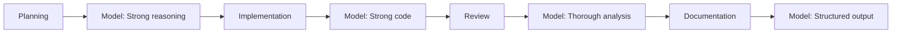
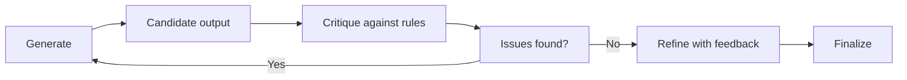

# AI Collaboration

## Purpose

This document defines how multiple AI systems and roles collaborate within the Hackathon Foundation framework. It establishes rules for multi-model workflows, task handoffs, conflict resolution, and consistency across sessions.

## Multi-AI collaboration model

Hackathon Foundation is AI-agnostic. Different AI models may be used for different phases of work. The collaboration model treats each model as an employee with specific strengths, not as a replacement for all others.

### Model routing

Different tasks benefit from different models. The framework supports routing tasks to the most appropriate model based on the nature of the work.

| Task type | Recommended model characteristics | Examples |
|---|---|---|
| Architecture and reasoning | Strong reasoning, long context | System design, trade-off analysis |
| Code generation | Strong code training | Implementation, debugging |
| Documentation | Structured output, clarity | READMEs, API docs |
| Review | Thorough, rule-based | Code review, security audit |
| Fast iteration | Low latency, high throughput | Prototyping, exploration |

### Multi-model workflow

A project may pass through multiple models across its lifecycle:



Each model receives the same shared context but applies its strengths to its assigned phase.

## Shared context principles

Every AI session, regardless of model, must start with the same shared context. This ensures consistency across models and sessions.

### Principle 1: Context before execution

No AI generates output before reading the relevant context. The minimum context includes:

- `company/handbook/mission.md` — Why the project exists
- `company/handbook/company-culture.md` — How the company operates
- Relevant section of `company/handbook/engineering-principles.md` — Technical standards
- Relevant policies from `company/policies/` — Rules that constrain output

### Principle 2: Context is additive

Each session adds new context. Previous decisions, code, and documentation become context for future sessions. The `.memory/` directory records what was done so that future sessions do not start from zero.

### Principle 3: Context is immutable during a session

Once a session begins, the context provided by the CEO is fixed. The AI does not modify its own context. If context needs to change, the session ends and a new one begins with updated context.

## Task handoff protocol

When a task moves from one AI role to another, a formal handoff occurs.

### Handoff steps

1. **Source AI completes its output.** The source role produces a deliverable and confirms it meets the definition of done.

2. **CEO reviews and approves.** The CEO reviews the output. Only approved output is handed off.

3. **CEO provides context to the next AI.** The CEO gives the next role the approved output plus the original context files. The next AI does not need to re-read the entire project — it receives the relevant subset.

4. **Next AI acknowledges.** The receiving AI confirms it has the context and understands the task.

5. **Next AI executes.** The receiving AI produces its output based on the handed-off context.

### Handoff format

```
Handoff from: Frontend Engineer
Handoff to: QA Engineer
Deliverable: Login form component (src/components/Login.tsx)
Context provided:
  - Feature specification (from Product Manager)
  - Component requirements (from UI/UX Designer)
  - Implementation: Login.tsx, Login.test.tsx
Definition of done checklist:
  - All acceptance criteria met: yes
  - Tests passing: yes
  - Documentation updated: yes
Notes: Form validates email format client-side.
       Server-side validation is handled by the API endpoint.
```

## Conflict resolution

When two AI models produce conflicting outputs, follow this resolution protocol:

### Step 1: Identify the conflict type

| Type | Example | Resolution |
|---|---|---|
| Style difference | Different naming conventions | Follow the rules in `company/policies/`. The policy decides. |
| Technical disagreement | Different approach to solving a problem | Evaluate both against the decision-making priority in `company/handbook/decision-making.md`. |
| Factual error | One model produces incorrect output | Escalate to CEO for review. The incorrect output is rejected. |
| Architecture conflict | Different component structures | Escalate to Software Architect role. Architecture decisions require human review. |

### Step 2: Apply the decision priority

When outputs differ on approach, evaluate both against:

1. **Correctness** — Which output is correct?
2. **Maintainability** — Which is easier to understand and change?
3. **Simplicity** — Which is simpler?
4. **Performance** — Which performs better?
5. **Optimization** — Which is more optimized (lowest priority)?

### Step 3: Escalate if unresolved

If the two approaches are evenly balanced, escalate to the CEO. The CEO makes the final decision.

## Review workflow

Every output passes through a three-stage review process:



### Stage 1: Generate

The AI produces a first draft of the output. This is the raw implementation — complete but not yet refined.

### Stage 2: Critique

The same AI (or a different role) critiques the output against:

- The task specification — does it do what was asked?
- The applicable rules — does it comply with policies?
- The definition of done — are all criteria met?
- Edge cases — are error conditions handled?

### Stage 3: Refine and finalize

Based on the critique, the AI refines the output. This may involve multiple iterations. The output is finalized when all critique items are resolved and the definition of done is satisfied.

## Escalation to stronger models

When a task exceeds the capabilities of the current model, escalate to a stronger model.

### Escalation triggers

- The current model produces consistently incorrect output.
- The task requires reasoning depth beyond the current model's capability.
- The context window is too small for the required input.
- The model does not support the required output format.

### Escalation protocol

1. **Document the limitation.** Record what the current model could not do and why.
2. **Select a stronger model.** Consult `resources/ai/` for model recommendations.
3. **Transfer the full context.** Provide all context, including what has already been done and what remains.
4. **The stronger model continues from the current state.** It does not restart from zero.

## Maintaining consistency across models

### Use the same rules

All models, regardless of provider or capability, must follow the same rules in `company/policies/`. Rules are model-independent.

### Use the same templates

All models use the same templates in `company/assets/`. A template produces consistent structure regardless of which model fills it in.

### Use the same context

All models start with the same shared context from `company/handbook/`. The source of truth is the handbook, not the model's training data.

### Review all output

Every model's output is reviewed against the same definition of done. The review process is model-independent.

## Stateless vs stateful AI behavior

### Stateless sessions (default)

By default, each AI session is stateless. The AI starts with no memory of previous sessions. All context must be provided explicitly.

**When to use stateless:**
- Starting a new task
- Switching to a different model
- Beginning a new phase of work
- When context has changed significantly

### Stateful sessions (with memory)

A stateful session uses `.memory/` files to maintain continuity across interactions within the same session.

**When to use stateful:**
- Iterative refinement of a single output
- Multi-turn debugging sessions
- Sequential steps within a single workflow

### Managing state

- State is stored in files, not in the AI's context window. The `.memory/` directory records decisions, todos, and timeline.
- Between sessions, the CEO updates `.memory/`. The next session reads `.memory/` to understand the current state.
- Within a session, the AI maintains state in its context window. The CEO can reset state by ending the session and starting a new one.

## Connection to company culture

This collaboration model supports the company values in [company-culture.md](./company-culture.md). Quality over speed is enforced through the review workflow. Think before coding is enforced through the shared context principles. Documentation first is enforced through the handoff protocol.
