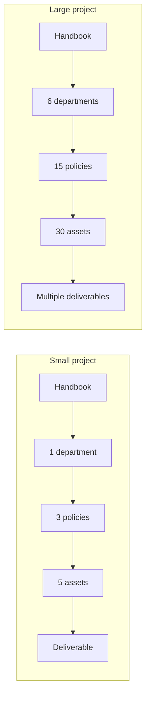

# Architecture Overview

## Purpose

This document provides a high-level system architecture overview of the Hackathon Foundation framework. It explains how the layers of the repository relate to each other and how AI agents navigate the structure to produce output.

## System hierarchy

The repository is organized into layers. Each layer has a distinct responsibility. Lower layers depend on the layers above them.

```
                    ┌─────────────────────┐
                    │      Handbook       │  Why we exist, how we think
                    │  (mission, culture, │
                    │   principles, DoD)  │
                    └──────────┬──────────┘
                               │
                    ┌──────────▼──────────┐
                    │     Departments     │  Who we are
                    │  (Engineering, QA,  │
                    │   Design, etc.)     │
                    └──────────┬──────────┘
                               │
                    ┌──────────▼──────────┐
                    │       Roles         │  What each employee does
                    │  (future layer —    │
                    │   role definitions) │
                    └──────────┬──────────┘
                               │
                    ┌──────────▼──────────┐
                    │      Policies       │  Rules we follow
                    │  (security, testing,│
                    │   coding standards) │
                    └──────────┬──────────┘
                               │
                    ┌──────────▼──────────┐
                    │       Assets        │  Tools we use
                    │  (templates, skills,│
                    │   workflows, etc.)  │
                    └──────────┬──────────┘
                               │
                    ┌──────────▼──────────┐
                    │    Deliverables     │  What we produce
                    │  (code, docs, tests,│
                    │   architecture)     │
                    └─────────────────────┘
```

### Layer descriptions

| Layer | Directory | Purpose | Example contents |
|---|---|---|---|
| Handbook | `company/handbook/` | Defines the company's identity, values, and standards | Mission, culture, principles, DoD |
| Departments | `company/departments/` | Organizes work into functional areas | Engineering, Design, Testing |
| Roles | (future) | Defines individual employee responsibilities | Software Architect, Frontend Engineer |
| Policies | `company/policies/` | Constrains output with non-negotiable rules | Security rules, testing rules |
| Assets | `company/assets/` | Provides reusable execution tools | Templates, skills, workflows |
| Deliverables | (project code) | The output produced by executing the above layers | Code files, documentation, tests |

## Flow of work

Work flows through the layers in a defined sequence:

```
Idea
  │
  ▼
Handbook ──────► Read mission, culture, principles
  │
  ▼
Department ────► Select the responsible department
  │
  ▼
Role ──────────► Assign the task to a specific role
  │
  ▼
Policies ──────► Apply the relevant rules
  │
  ▼
Assets ────────► Use templates, skills, workflows
  │
  ▼
Execution ─────► Produce the deliverable
  │
  ▼
Review ────────► Check against definition of done
  │
  ▼
Output ────────► Approved deliverable
```

### Step-by-step flow

1. **Idea.** The CEO identifies a need — a feature, a bug fix, documentation, or architecture work.

2. **Handbook.** The relevant AI role reads the handbook sections that apply. This ensures every output is aligned with the company's mission, culture, and principles.

3. **Department.** The CEO determines which department owns the work. Engineering for code. Testing for quality. Design for UI.

4. **Role.** Within the department, the CEO selects the specific role. Frontend Engineer for UI components. Backend Engineer for API endpoints.

5. **Policies.** The AI role reads the relevant policies. Security rules for authentication. Testing rules for test coverage. Coding standards for style.

6. **Assets.** The AI role selects and uses the relevant assets. A template for the output structure. A skill for the execution steps. A workflow for the process.

7. **Execution.** The AI produces the deliverable — code, documentation, tests, architecture document.

8. **Review.** The deliverable is reviewed against the definition of done. If it passes, it is accepted. If not, it is refined.

9. **Output.** The approved deliverable is saved to the project. Memory is updated. Summaries are updated.

## How AI agents navigate this structure

An AI agent traverses the repository layers by following a consistent navigation pattern:

### Navigation path

```
1. Read:     company/handbook/mission.md
             company/handbook/company-culture.md
             company/handbook/engineering-principles.md

2. Identify: company/departments/ → relevant department

3. Apply:    company/policies/ → relevant policy files

4. Use:      company/assets/ → relevant templates
             company/assets/ → relevant skills
             company/assets/ → relevant workflows

5. Verify:   company/handbook/definition-of-done.md

6. Record:   .memory/ → decisions, timeline, todos
             .summaries/ → state, changes, next steps
```

### Navigation rules

- **Start at the top.** Always read the handbook before reading anything else. The handbook defines the context for everything below.
- **Follow dependencies.** Departments reference policies. Policies reference assets. Assets produce deliverables. Do not skip layers.
- **Read the relevant subset.** An AI building a frontend component does not need to read security policies for database access. Read only what applies to the current task.
- **Ask when uncertain.** If the AI does not know which layer applies to a given task, it should ask the CEO for clarification.

## Layer interactions

### Handbook ↔ Departments

The handbook defines the principles that departments follow. A department's role definitions must be consistent with the handbook's mission, culture, and principles. If a contradiction exists, the handbook wins.

### Departments ↔ Policies

Departments define who does the work. Policies define how the work must be done. A Frontend Engineer (department: Engineering) must follow frontend policies. A QA Engineer (department: Testing) must follow testing policies.

### Policies ↔ Assets

Policies constrain what is acceptable. Assets provide the means to achieve it. A security policy might require parameterized queries. The build-api skill shows how to implement them.

### Assets → Deliverables

Assets are the direct inputs to execution. A template defines the structure of a deliverable. A skill defines the steps to produce it. A workflow defines the sequence of steps across multiple roles.

## Scalability

The same architecture works for projects of any size:



The layers are the same. The depth changes. Small projects use fewer departments, policies, and assets. Large projects use more. The navigation pattern is identical.

## Connection to repository philosophy

This architecture is a direct implementation of the principles in [repository-philosophy.md](./repository-philosophy.md). The repository is structured as a company, with clear separation between knowledge and execution, policies and assets, departments and roles.
