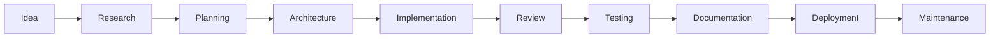

# Project Lifecycle

## Purpose

This document describes the stages of an engineering project from idea to maintenance. Every project — whether a hackathon submission or a long-term application — passes through these stages.

## Lifecycle stages

### 1. Idea

Every project starts with an idea. The idea may come from the CEO, a user, a hackathon theme, or a technical exploration.

**Activities:**
- Define the problem to be solved
- Identify the target users
- State the desired outcome
- Record the idea in `.memory/features.md`

**Output:** Problem statement, user need, or feature request.

**Check:** Can the idea be stated in one sentence?

---

### 2. Research

Before committing to a solution, understand the landscape.

**Activities:**
- Investigate existing solutions and approaches
- Identify potential technologies and tools
- Evaluate constraints (time, free tools, skill level)
- Check existing assets for reusable components

**Output:** Research summary with options and recommendations.

**Check:** Are there existing solutions or assets that could be used or adapted?

---

### 3. Planning

Define what will be built and how it will be approached.

**Activities:**
- Break the idea into concrete tasks
- Estimate effort for each task
- Identify dependencies between tasks
- Define success criteria
- Select the engineering roles needed

**Output:** Task breakdown with estimated effort and role assignments.

**Check:** Can each task be assigned to a single role?

---

### 4. Architecture

Design the system before building it.

**Activities:**
- Define system components and their relationships
- Select the technology stack
- Design data models and API contracts
- Document architecture decisions
- Review the architecture with relevant roles

**Output:** Architecture decision record, system diagram, component specifications.

**Check:** Is the architecture consistent with the project's goals and constraints?

---

### 5. Implementation

Build the system according to the architecture.

**Activities:**
- Write code following the defined rules and standards
- Use existing assets (templates, skills) where applicable
- Write tests alongside code
- Commit changes incrementally

**Output:** Working code that implements the planned features.

**Check:** Does the implementation match the architecture? Are tests passing?

---

### 6. Review

Review the implementation before accepting it.

**Activities:**
- Review code for correctness, style, and standards compliance
- Verify the implementation matches the architecture
- Check for security vulnerabilities
- Identify areas for improvement

**Output:** Review report with issues and recommendations.

**Check:** Does the code meet the definition of done? (See [definition-of-done.md](./definition-of-done.md).)

---

### 7. Testing

Verify that the implementation works correctly.

**Activities:**
- Execute automated tests
- Perform manual testing for critical paths
- Test edge cases and error conditions
- Verify fixes for identified issues

**Output:** Test results, bug reports, and verification of fixes.

**Check:** Do all critical paths work correctly? Are there any unresolved bugs?

---

### 8. Documentation

Document the implementation so others can use and maintain it.

**Activities:**
- Write or update README files
- Document API endpoints
- Document architecture decisions
- Update setup and deployment guides
- Create user-facing documentation if applicable

**Output:** Updated documentation consistent with the implementation.

**Check:** Is every public interface documented? Can a new user set up and use the project?

---

### 9. Deployment

Make the project available for use.

**Activities:**
- Configure the deployment environment
- Run the deployment process
- Verify the deployed application works
- Document deployment steps

**Output:** Deployed application with verified functionality.

**Check:** Does the deployed application work as expected?

---

### 10. Maintenance

Keep the project running and evolving.

**Activities:**
- Monitor for issues and errors
- Address bug reports
- Implement feature requests
- Update dependencies and tools
- Refine documentation

**Output:** Ongoing project health and evolution.

**Check:** Is the project stable? Are outstanding issues being addressed?

## Adapting for hackathons

In a hackathon context, the lifecycle is compressed but not skipped:

- **Idea + Research.** First 1-2 hours. Validate the idea quickly.
- **Planning + Architecture.** Next 1-2 hours. Define the core scope.
- **Implementation.** The bulk of the time. Build the core features.
- **Review + Testing.** Continuous throughout implementation.
- **Documentation.** Last 1-2 hours. Document what was built.
- **Deployment.** Before submission. Ensure it runs.
- **Maintenance.** After the hackathon (optional).

## Connection to roles

Each lifecycle stage is owned by specific roles:

| Stage | Primary role | Supporting roles |
|---|---|---|
| Idea | Product Manager | CEO |
| Research | Research Engineer | Software Architect |
| Planning | Project Manager | Product Manager |
| Architecture | Software Architect | All engineering roles |
| Implementation | Assigned engineer | QA Engineer |
| Review | Code Reviewer | Security Engineer |
| Testing | QA Engineer | Assigned engineer |
| Documentation | Documentation Engineer | All roles |
| Deployment | DevOps Engineer | Assigned engineer |
| Maintenance | All roles | CEO |

For role definitions, see `company/departments/`.
