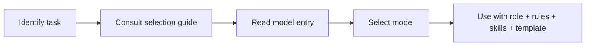

# AI Directory

## Purpose

This document introduces the AI directory — the collection of free AI models that Hackathon Foundation supports. It explains how models are cataloged, how they are selected, and how the directory stays current.

For the model catalog, see [FREE_MODELS.md](./FREE_MODELS.md). For selecting the right model for a task, see [MODEL_SELECTION_GUIDE.md](./MODEL_SELECTION_GUIDE.md).

## What the AI directory is

The AI directory is a catalog of free AI models that can be used with the Hackathon Foundation framework. Each model entry documents:

- What the model is good at
- What the model struggles with
- Which engineering roles it fits best
- Example workflows it excels at

The directory is not a ranking. There is no "best" model. Each model has strengths and weaknesses, and the right choice depends on the task.

## Selection criteria

Every model in the directory must satisfy these criteria:

| Criterion | Requirement |
|---|---|
| Free | No paid tier required for core functionality. Free tier is sufficient for hackathon use. |
| Accessible | Available through a web interface, API, or local execution that a student can set up. |
| Capable | Sufficient quality for engineering tasks — code generation, debugging, documentation, review. |
| Maintained | Actively developed and supported. Not abandoned or deprecated. |
| Verifiable | Claims about capabilities are verifiable through public benchmarks or community experience. |

## How models are categorized

Models are categorized by:

- **Size** — Small (fast, low resource), Medium (balanced), Large (most capable, more resource)
- **Architecture** — Dense transformer, mixture of experts, etc.
- **Access** — Web chat, API, local download, cloud notebook
- **Primary strength** — Code, reasoning, instruction following, multilingual

## Philosophy

### No single best model

Different tasks benefit from different models. A model that excels at creative writing may struggle with precise code generation. A model optimized for speed may lack depth for complex architecture decisions.

The framework encourages matching the model to the task, not using one model for everything.

### Free is sufficient

Free models in 2026 are capable of professional-quality engineering work. The limiting factor is no longer model quality — it is orchestration, context management, and workflow discipline. The Hackathon Foundation framework provides the structure; the free models provide the execution.

### Models change; the directory adapts

The AI model landscape evolves rapidly. New models emerge. Old models improve. Pricing changes. The directory is updated as the landscape changes, but the selection criteria remain stable.

## How to use the directory

1. Identify the task (e.g., "design an API endpoint").
2. Consult [MODEL_SELECTION_GUIDE.md](./MODEL_SELECTION_GUIDE.md) to find candidate models.
3. Read the model entry in [FREE_MODELS.md](./FREE_MODELS.md) for strengths and weaknesses.
4. Select the model that best matches the task and available access method.
5. Use the model with the relevant role definition, rules, skills, and templates.

## Future-proofing

The directory is designed to remain useful as the AI landscape evolves:

- **Additive.** New models are added to the catalog when they meet the selection criteria. Existing entries are not removed unless a model becomes paid or abandoned.
- **Descriptive, not prescriptive.** The directory describes what models are good at. It does not prescribe which model to use. As models improve, descriptions are updated.
- **Access-agnostic.** Models are categorized by how they can be accessed, not by which platform hosts them. If a model becomes available through a new access method, the entry is updated.
- **Community-driven.** Contributions to model entries are welcome. If a model's strengths or weaknesses change based on community experience, entries are updated.

For the complete model catalog, see [FREE_MODELS.md](./FREE_MODELS.md). For task-based model recommendations, see [MODEL_SELECTION_GUIDE.md](./MODEL_SELECTION_GUIDE.md). For how to use these models with different AI coding assistants, see [INTEGRATIONS.md](./INTEGRATIONS.md).
