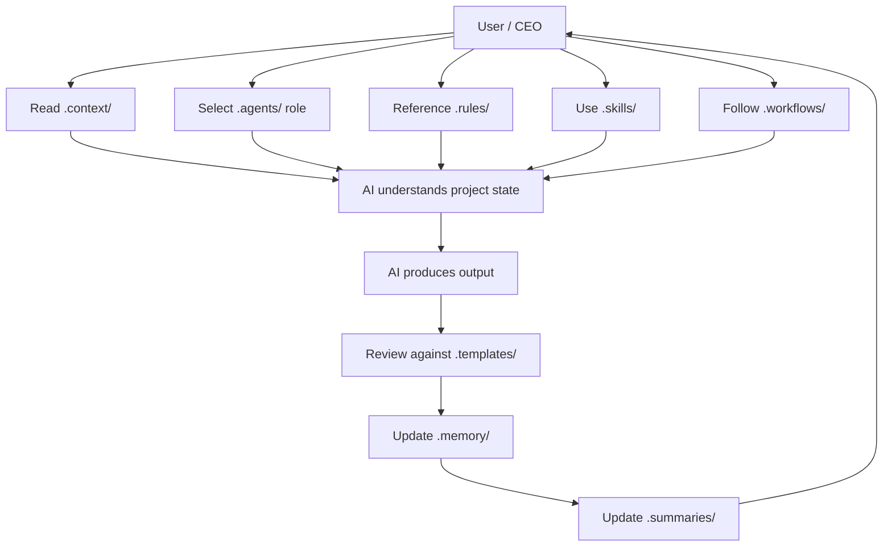

# Architecture

## Purpose

This document describes the architecture of the Hackathon Foundation repository. It explains how the different parts of the repository relate to each other, how information flows through the system, and how the mental model of a "company" maps onto the folder structure.

## Repository philosophy

Hackathon Foundation does not contain code. It contains **structure**. The repository is a template for organizing human-AI collaboration, not a software library. Its architecture reflects this purpose.

The fundamental premise is:

> A well-structured repository is a well-structured engineering team.

Every folder, file, and naming convention exists to reduce friction between the human (CEO) and the AI (employees). The architecture prioritizes discoverability, consistency, and reuse over cleverness or automation.

## The company mental model

The entire repository is organized around a simple analogy (see [COMPANY_MODEL.md](./COMPANY_MODEL.md) for the full model):

```
User (CEO)
    │
    ├── .agents/        ──  Employees
    ├── .context/       ──  Company wiki / handbook
    ├── .rules/         ──  Company policies
    ├── .skills/        ──  Department capabilities
    ├── .workflows/     ──  Standard operating procedures
    ├── .templates/     ──  Forms and blueprints
    ├── .playbooks/     ──  Strategic playbooks
    ├── .memory/        ──  Institutional memory
    ├── .summaries/     ──  Executive summaries
    ├── .mcp/           ──  External integrations
    ├── .prompts/       ──  Communication scripts
    └── docs/           ──  Public documentation
```

## How information flows

The repository is designed for a specific interaction pattern. The user (CEO) reads context, assigns a role, and the AI executes within boundaries.



### Information flow in detail

1. **CEO reads context.** Before engaging an AI, the user reads `.context/` to understand the project's goals, architecture, and standards. This ensures the human is aligned before directing the AI.

2. **CEO selects a role.** The user opens `.agents/<role>/` and reads the agent's system prompt, rules, skills, and workflow. This defines *who* the AI is for this session.

3. **CEO provides context to AI.** The user copies or references the relevant context files, role definitions, and rules into their AI coding assistant (OpenCode, Gemini CLI, Continue, etc.).

4. **AI executes.** The AI produces code, documentation, tests, or analysis according to the role's responsibilities and the project's rules.

5. **CEO reviews output.** The user checks the output against templates and checklists in `.templates/` and `.checklists/`.

6. **Memory is updated.** The user (or AI) updates `.memory/` to record what was done, what was decided, and what changed.

7. **Summaries are updated.** Key changes are reflected in `.summaries/` for future reference.

## Separation of responsibilities

Each top-level folder owns a distinct concern:

| Folder | Responsibility | Analogous to |
|---|---|---|
| `.agents/` | Role definitions | Job descriptions |
| `.context/` | Shared project knowledge | Company wiki |
| `.rules/` | Constraints and policies | Employee handbook |
| `.skills/` | Reusable capabilities | Department expertise |
| `.workflows/` | Step-by-step processes | Standard operating procedures |
| `.playbooks/` | High-level strategies | Strategic plans |
| `.templates/` | Output blueprints | Forms and templates |
| `.memory/` | Project history | Institutional memory |
| `.summaries/` | Condensed state | Executive dashboard |
| `.mcp/` | Tool configurations | Software integrations |
| `.prompts/` | Ready-to-use prompts | Communication scripts |
| `docs/` | Public documentation | Marketing / help center |

These responsibilities do not overlap. If a piece of information could logically belong to two folders, the architectural rule is: **put it in the folder that is more specific and cross-reference it from the other.**

## Modularity

The repository is modular in three dimensions:

### 1. Vertical modularity

Each folder is self-contained. You can copy `.agents/software-architect/` to another project without copying the entire repository. The role definition references `.context/`, `.rules/`, and `.skills/` by name but does not require their physical presence in the same directory.

### 2. Horizontal modularity

Within a folder, each item is independent. A rule file for React does not depend on a rule file for TypeScript. A skill for building APIs does not depend on a skill for building components. You can add, remove, or update items without affecting unrelated items.

### 3. Cross-cutting modularity

Skills and workflows reference context files and rules by convention. This means the same skill can work with different context files in different projects. The modularity happens through naming conventions and path conventions, not through imports or dependencies.

## Scalability

The architecture scales through depth, not breadth. A small hackathon project might use only a few roles, context files, and templates. A large project might use many. The structure does not change.

```mermaid
flowchart LR
    subgraph Small Project
        A1[.agents/</br>2 roles]
        B1[.context/</br>3 files]
        C1[.templates/</br>2 files]
    end

    subgraph Large Project
        A2[.agents/</br>14 roles]
        B2[.context/</br>12 files]
        C2[.templates/</br>20 files]
    end

    Small Project -->|"grows by adding depth"| Large Project
```

The repository grows by adding more of the same kind of thing — more roles, more skills, more templates — not by adding new structural layers.

## How AI should use the repository

An AI coding assistant should never read the entire repository. It should receive only what is relevant to the current task.

The intended usage pattern:

```
1. User chooses a role from .agents/
2. User selects relevant .context/ files
3. User selects applicable .rules/ files
4. User selects a .workflow/ to follow
5. User provides these to the AI in their prompt
6. AI executes and produces output
7. User saves output, updates .memory/ and .summaries/
```

The AI should be told *who it is* (the role), *what it knows* (context), *how it behaves* (rules), *what it does* (workflow), and *what to produce* (template). The repository architecture is designed to make each of these retrievable independently.

## Long-term maintenance

The architecture supports long-term maintenance through:

- **Immutable folder structure.** The top-level folders are permanent. They do not change as the project evolves. New content goes inside existing folders.
- **No external dependencies.** The repository is plain files. It does not depend on any build tool, package manager, or runtime. It will work the same way in 10 years as it does today.
- **Convention over configuration.** Files follow consistent naming and path conventions. This makes them findable by both humans and AI without a configuration file.
- **Self-documenting.** Every folder has a README explaining its purpose. Every file is documented within its own structure. The repository does not need an external documentation generator.

For a detailed map of every folder and file, see [REPOSITORY_STRUCTURE.md](./REPOSITORY_STRUCTURE.md). For the principles that guided this architecture, see [DESIGN_PRINCIPLES.md](./DESIGN_PRINCIPLES.md). For the fundamental concepts that underpin the framework, see [CORE_CONCEPTS.md](./CORE_CONCEPTS.md).
