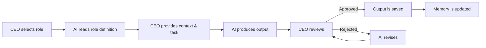
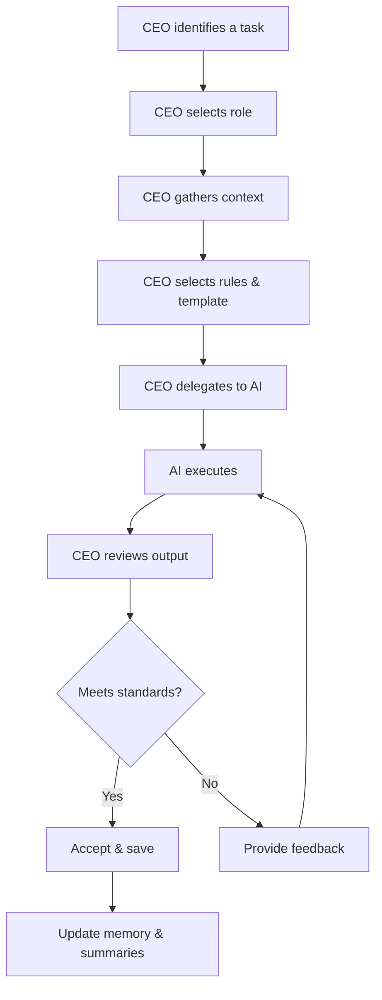
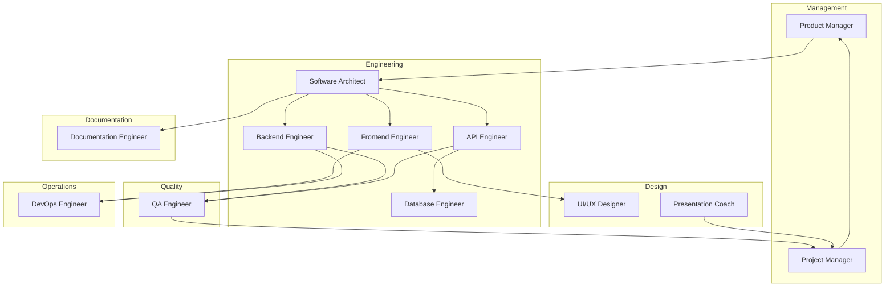

# Company Model

## Purpose

This document defines the company model that gives Hackathon Foundation its structure. It explains how the repository maps to a software engineering organization and how every folder, role, and process fits into that analogy.

## The model

Hackathon Foundation is not a library, a framework, or a collection of prompts. It is a **modeled software company**. The repository structure, the role definitions, the rules, the workflows — everything exists to simulate a well-run engineering organization.

The core mapping:

```
Repository              → Company
User                    → CEO / Founder
AI coding assistant     → Employee
.agents/<role>/         → Job description
.context/               → Company wiki / handbook
.rules/                 → Company policies
.skills/                → Department expertise
.workflows/             → Standard operating procedures
.templates/             → Forms and blueprints
.memory/                → Institutional memory
.summaries/             → Executive dashboard
.playbooks/             → Strategic plans
.mcp/                   → Tool integrations
.prompts/               → Communication scripts
docs/                   → Public documentation
```

## Why a company model

### Clarity through analogy

Software engineering organizations already solve the problems that hackathon developers face: how to divide work, how to maintain quality, how to ensure consistency, how to manage context. By adopting the same structure, Hackathon Foundation inherits proven solutions.

### Role clarity

In a company, a Software Architect does not write frontend components. A QA Engineer does not design the database schema. Each role has a clear scope. The same principle applies here. When an AI is assigned the "Frontend Engineer" role, it produces frontend code — not architecture decisions, not deployment scripts, not documentation.

### Accountability

A company has clear ownership. If a bug reaches production, the responsible team is identified. The repository mirrors this: every file, every decision, every task is owned by a specific role. Nothing falls through the cracks.

### Scalability

A company scales by adding people, not by reorganizing. The repository scales by adding roles and skills, not by changing the folder structure. The mental model scales with the project.

## The CEO (User)

The user is the CEO. This means:

- **You decide what to build.** The AI does not choose the project direction.
- **You assign tasks.** You select which role handles which task.
- **You review output.** Every deliverable is reviewed before it is accepted.
- **You maintain memory.** You ensure that project state, decisions, and todos are recorded.
- **You manage context.** You provide the relevant context files, rules, and templates for each session.

The CEO does not need to be a technical expert. The CEO needs to be a good **manager** — able to define what success looks like, assign the right role, provide clear context, and review the output critically.

## Employees (AI Coding Assistants)

AI coding assistants are employees. Each employee has:

- A **role** that defines their responsibilities and scope.
- **Rules** that constrain their behavior.
- **Skills** that define what they can do.
- A **workflow** that defines how they work.
- **Templates** that define what they produce.
- **Context** that defines what they need to know.

Employees do not choose their tasks. They execute what the CEO assigns. They produce output according to their role definition and the project's standards.

### Employee lifecycle



## Departments

Employees are organized into departments. Each department has a focus area and contains related roles.

| Department | Focus | Roles |
|---|---|---|
| Engineering | Building the product | Software Architect, Frontend Engineer, Backend Engineer, Database Engineer, API Engineer, Security Engineer, DevOps Engineer, Performance Engineer |
| Design | User experience | UI/UX Designer, Presentation Coach |
| Testing | Quality assurance | QA Engineer |
| Documentation | Knowledge management | Documentation Engineer |
| Operations | Infrastructure and delivery | DevOps Engineer |
| Management | Project leadership | Project Manager, Product Manager |
| Community | External engagement | (reserved for future phases) |

For a complete list of departments and their roles, see [DEPARTMENTS.md](./DEPARTMENTS.md).

## Communication

### CEO to Employee

Communication flows one way during execution: the CEO provides context and a task, the AI produces output.

```
CEO: "Here is the context. Here is the task. You are the Frontend Engineer."
AI:  "Here is the component you requested."
CEO: "Approved. Update memory."
```

### Between Employees

In a traditional company, employees communicate with each other. In this model, the CEO is the communication channel. If the Frontend Engineer needs an API specification, the CEO assigns the Backend Engineer to produce it, then provides it to the Frontend Engineer.

```
Frontend Engineer needs API spec
        │
        ▼
CEO assigns Backend Engineer
        │
        ▼
Backend Engineer produces API spec
        │
        ▼
CEO reviews and approves
        │
        ▼
CEO provides API spec to Frontend Engineer
```

This ensures that the CEO maintains visibility into all decisions. Nothing happens without the CEO's awareness.

### Communication standards

- **Context is written, not spoken.** All project knowledge is documented in `.context/`. Verbal instructions are ephemeral and should be recorded.
- **Tasks are explicit.** The CEO states the task, the role, the context to use, the rules to follow, and the template to fill.
- **Output is reviewed.** Every deliverable is reviewed against the project's quality standards before it is accepted.
- **Memory is updated after every session.** The `.memory/` directory records what was done, what was decided, and what changed.

## Task delegation

Task delegation follows a consistent pattern:



### Delegation principles

1. **One task per session.** Do not ask one AI to do multiple things. Each session has one role, one task, one output.
2. **Context first.** Before the AI writes anything, it reads the relevant context. Never skip this step.
3. **Rules are non-negotiable.** The AI follows the rules. If the output violates a rule, it is rejected.
4. **Templates define structure.** The AI fills in the template. It does not invent a new format.
5. **Review is mandatory.** Every output is reviewed. Trust is earned, not assumed.

## Outputs

Every employee produces outputs. The type of output depends on the role.

### Output types

| Role | Typical outputs |
|---|---|
| Software Architect | Architecture decision records, system design documents, technology choices |
| Frontend Engineer | React components, pages, styles, state management |
| Backend Engineer | API endpoints, business logic, data validation |
| Database Engineer | Schema designs, migrations, queries |
| API Engineer | API specifications, endpoint implementations, integration tests |
| QA Engineer | Test plans, test cases, bug reports |
| Security Engineer | Security reviews, vulnerability assessments, threat models |
| DevOps Engineer | CI/CD configurations, deployment scripts, infrastructure specs |
| Documentation Engineer | User guides, API documentation, setup guides |
| UI/UX Designer | Wireframes, design specs, component designs |
| Presentation Coach | Presentation outlines, slide content, talking points |
| Project Manager | Task lists, timelines, status reports |
| Product Manager | Feature specifications, user stories, priority lists |

### Output standards

All outputs must:

1. Follow the relevant template in `.templates/`
2. Comply with the rules in `.rules/`
3. Be consistent with the context in `.context/`
4. Be reviewed by the CEO before acceptance
5. Be recorded in `.memory/` after acceptance

## How departments work together



For detailed department definitions, see [DEPARTMENTS.md](./DEPARTMENTS.md). For role-specific responsibilities, see [RESPONSIBILITIES.md](./RESPONSIBILITIES.md). For the end-to-end workflow, see [WORKFLOW_OVERVIEW.md](./WORKFLOW_OVERVIEW.md).
