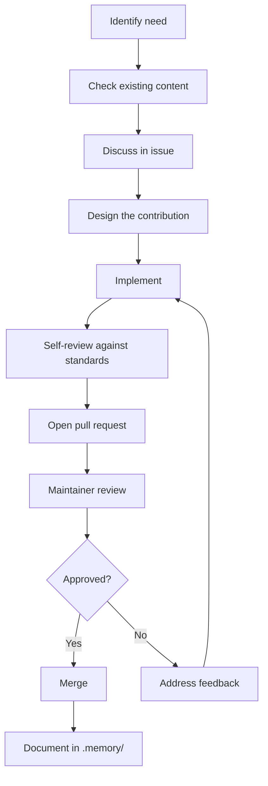

# Contributing

## Purpose

This document explains how to contribute to Hackathon Foundation. It covers the contribution workflow, repository standards, and expectations for all contributions.

## Philosophy

Hackathon Foundation is a community-driven open-source project. Every contribution — whether a new role definition, a skill refinement, a rule update, or a documentation fix — makes the framework better for everyone.

The contribution philosophy is:

> Design before implement. Review before merge. Document before close.

## Who can contribute

Anyone can contribute. The project is designed to be beginner-friendly. You do not need to be an experienced open-source contributor to participate.

### Contribution types

- **New roles.** Add a new `.agents/<role>/` directory with system prompt, rules, skills, workflow, examples, and output definition.
- **New skills.** Add a new `.skills/<skill>/` directory with a step-by-step guide for a reusable capability.
- **New rules.** Add a new `.rules/<domain>.md` file with rules for a technology or practice.
- **New templates.** Add a new `.templates/<type>.md` file with a structure for a common deliverable.
- **Refinements.** Improve existing role definitions, skills, rules, or templates based on real hackathon experience.
- **Documentation.** Improve any file in `docs/` — fix errors, add clarity, fill gaps.
- **Free model updates.** Update `.docs/FREE_MODELS.md` when a model's capabilities or free tier status changes.
- **Integration guides.** Add `.integrations/<tool>/README.md` for a new AI coding assistant.

## Repository standards

### File standards

Every file in the repository must satisfy these standards:

| Standard | Requirement |
|---|---|
| Purpose | Every file begins with a Purpose section explaining why it exists. |
| Structure | Files follow the structure defined in the relevant template. |
| Cross-linking | Every document links to related documents. |
| Consistency | Naming, tone, formatting, and depth are uniform across files. |
| Free-only | No paid tools, models, or services are referenced. |
| AI-agnostic | No file assumes a specific AI model or coding assistant. |

### Naming conventions

- Directories use kebab-case (e.g., `software-architect`, `build-component`).
- Files use kebab-case with `.md` extension (e.g., `tech-stack.md`, `react.md`).
- README files are always `README.md`.

### Content standards

- Write in clear, professional English.
- Use markdown formatting consistently.
- Prefer bullet points and tables over long paragraphs.
- Include examples where helpful.
- Do not include code — the repository contains structure, not code.

## Contribution workflow

### Step 1: Identify a need

Look for gaps, errors, or improvements in the repository. Common needs:

- A role that does not exist yet
- A skill that would be useful across projects
- A rule for a technology not yet covered
- A template that would save time
- Documentation that is unclear or missing

### Step 2: Check existing content

Before creating something new, check if similar content already exists. Avoid duplication.

### Step 3: Discuss in an issue

Open a GitHub issue describing your proposed contribution. Explain:

- What you want to add or change
- Why it is needed
- How it fits into the existing structure

This prevents wasted work if the contribution is not aligned with the project direction.

### Step 4: Design

Design the contribution before writing it. For a new role:

- What is the role's purpose?
- What department does it belong to?
- What are its responsibilities?
- What rules does it follow?
- What skills does it use?
- What templates does it produce?

### Step 5: Implement

Create the files following the repository's conventions. Use existing content as a reference.

### Step 6: Self-review

Before submitting, review your contribution against:

- Does it satisfy the file standards?
- Does it follow the naming conventions?
- Is it consistent with existing content in tone and structure?
- Does it cross-link to related documents?
- Does it reference only free tools and models?
- Is it AI-agnostic?

### Step 7: Open a pull request

Create a pull request with a clear description:

- What was changed
- Why it was changed
- How it was reviewed
- Any questions or concerns

### Step 8: Address feedback

Maintainers may request changes. Address the feedback and update the pull request.

### Step 9: Merge

Once approved, the contribution is merged.

### Step 10: Document

The contribution is recorded in `.memory/` — what was added, why, and when.

## Review criteria

Pull requests are reviewed against these criteria:

| Criterion | Description |
|---|---|
| Purpose | Does the contribution have a clear purpose? |
| Quality | Is the content well-written and accurate? |
| Consistency | Does it match the repository's style and structure? |
| Free-only | Does it reference only free tools and models? |
| AI-agnostic | Does it avoid assuming a specific AI tool? |
| Cross-linking | Does it link to related documents? |
| No code | Does it avoid including executable code? |

## Communication

- **Be respectful.** Follow the Code of Conduct.
- **Be specific.** When suggesting a change, explain what and why.
- **Be patient.** Maintainers review contributions as time permits.

For the community guidelines, see [COMMUNITY.md](./COMMUNITY.md). For the code of conduct, see [CODE_OF_CONDUCT.md](./CODE_OF_CONDUCT.md). For the project roadmap, see [ROADMAP.md](./ROADMAP.md).
