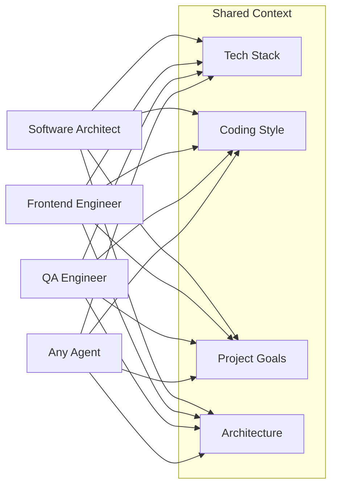
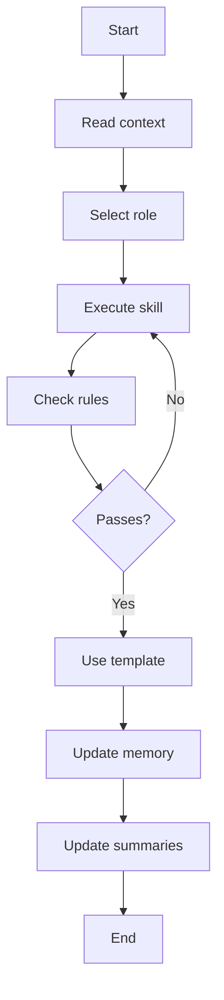
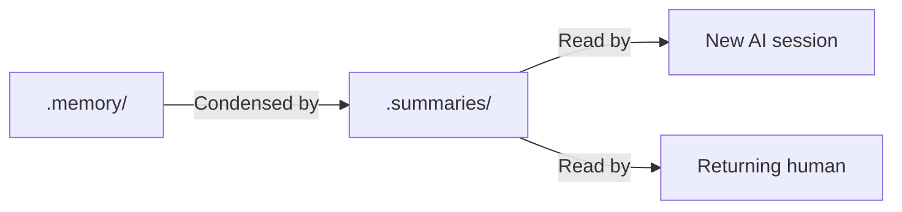
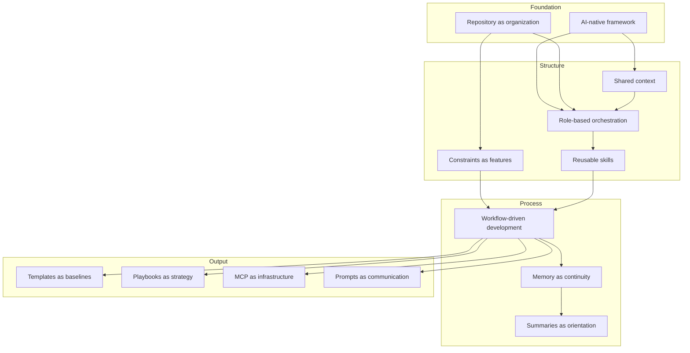

# Core Concepts

## Purpose

This document defines the fundamental concepts that underpin the Hackathon Foundation framework. These concepts are the building blocks that every other document, folder, and file in the repository depends on.

## Concepts

### 1. AI-native engineering framework

Hackathon Foundation is an AI-native engineering framework. This means:

- AI assistance is not an afterthought — it is the primary development mechanism.
- The structure is designed for human-AI collaboration, not human-only or AI-only workflows.
- Roles, rules, skills, and workflows all assume an AI coding assistant will execute them.

An AI-native framework differs from traditional software engineering frameworks in that it explicitly organizes *how* the human and AI interact, not just *what* they produce.

---

### 2. The repository as an organization

The repository is not a collection of files. It is a modeled organization. See [COMPANY_MODEL.md](./COMPANY_MODEL.md) for the full model and [DEPARTMENTS.md](./DEPARTMENTS.md) for department structure.

| Element | Real-world analog |
|---|---|
| User | CEO / Founder |
| AI coding assistant | Employee |
| `.agents/<role>/` | Job description |
| `.context/` | Company wiki / handbook |
| `.rules/` | Company policies |
| `.skills/` | Department capabilities |
| `.workflows/` | Standard operating procedures |
| `.templates/` | Forms and blueprints |
| `.memory/` | Institutional memory |
| `.summaries/` | Executive dashboard |
| `.playbooks/` | Strategic plans |

This is not a metaphor. It is the architectural model. Every design decision flows from it.

---

### 3. Role-based AI orchestration

An AI coding assistant behaves differently depending on the role it is assigned. A "Software Architect" produces architecture decisions. A "QA Engineer" produces test plans. The same AI model, with the same capabilities, produces different outputs based on the role definition it receives.

Role-based orchestration means:

- The user selects a role based on the current task.
- The AI reads the role definition (system prompt, rules, skills, workflow).
- The AI produces output consistent with that role.
- The user switches roles as the task changes.

---

### 4. Shared context

AI coding assistants have no inherent knowledge of the project they are working on. They do not know the tech stack, coding style, architecture, or goals unless told. Shared context is the mechanism that provides this knowledge.

The key principle: **context is read before any output is produced.** Every AI session starts with the same shared context, ensuring consistency regardless of which role is active or which model is used.

---

### 5. Constraints as features

Rules and policies are not restrictions. They are *design constraints* that produce better output:

- **Naming conventions** make code consistent.
- **Security rules** prevent vulnerabilities.
- **Testing requirements** ensure quality.
- **Rule scope** prevents scope creep.

The framework treats constraints as features. A well-constrained AI produces more predictable, more consistent, and more professional output than an unconstrained one.

---

### 6. Reusable skills

A skill is a documented capability that can be executed by any role. Skills are:

- **Self-contained.** A skill document includes everything needed to perform the task.
- **Role-independent.** Any agent can execute any skill.
- **Composable.** Skills can be combined within workflows.

Examples: building a component, creating an API, debugging an error, reviewing code for security issues, writing documentation.

---

### 7. Workflow-driven development

A workflow is a sequence of steps that transforms a project state. Each step specifies:

- Which role to use
- Which context to read
- Which rules to follow
- Which skills to execute
- Which template to use for output
- How to verify the result

Workflows turn ad-hoc development into repeatable processes. They are the "how" of the framework.

---

### 8. Memory as continuity

AI coding assistants have no persistent memory. Each session starts with no knowledge of previous sessions. Memory files provide the continuity that the AI lacks.

Memory tracks:

- **Project state.** What exists, what works, what is broken.
- **Decisions.** Why certain choices were made.
- **Timeline.** What happened and when.
- **Todos.** What remains to be done.
- **Bugs.** Known issues and their status.
- **Features.** Planned and requested features.

Memory is the project's institutional knowledge. Without it, every AI session starts from zero.

---

### 9. Summaries as orientation

Summaries are condensed versions of memory — short enough to read in seconds, comprehensive enough to orient a new AI session or a returning human.

---

### 10. Templates as quality baselines

A template defines the expected structure and content of a deliverable. Using a template ensures:

- **Completeness.** No section is forgotten.
- **Consistency.** Every deliverable of the same type follows the same format.
- **Efficiency.** The AI fills in a structure instead of inventing one.

Templates are not restrictive — they are starting points that guarantee minimum quality.

---

### 11. Playbooks as strategy

A playbook is a high-level strategy for running a hackathon. It covers non-technical aspects:

- Time management across the event duration
- Idea validation and selection
- Team formation and communication
- Presentation preparation
- Submission requirements

Playbooks sit above workflows. They tell you *what* to prioritize; workflows tell you *how* to execute.

---

### 12. MCP as infrastructure

MCP (Model Context Protocol) configurations provide AI coding assistants with access to external tools — file systems, version control, browsers, databases, and APIs.

MCP configurations are:

- **Tool-specific.** Each configuration file defines one integration.
- **Optional.** The framework works without MCP. MCP enhances but does not replace.
- **Reproducible.** Configurations can be shared and reused across projects.

---

### 13. Prompts as communication templates

Prompts are the messages that the user sends to the AI. A prompt library captures effective prompts so they can be reused and refined.

Prompts are different from other files in the repository:

- **Context** is *what the AI should know.*
- **Rules** are *how the AI should behave.*
- **Roles** are *who the AI should be.*
- **Skills** are *what the AI should do.*
- **Workflows** are *what process the AI should follow.*
- **Prompts** are *what to say to the AI.*

---

## Concept relationship diagram

## How concepts map to folders

| Concept | Primary folder | Secondary folders |
|---|---|---|
| AI-native framework | (global) | All |
| Repository as organization | (global) | All |
| Role-based orchestration | `.agents/` | `.context/`, `.rules/` |
| Shared context | `.context/` | `.agents/` |
| Constraints as features | `.rules/` | `.agents/`, `.skills/` |
| Reusable skills | `.skills/` | `.workflows/` |
| Workflow-driven development | `.workflows/` | All |
| Memory as continuity | `.memory/` | `.summaries/` |
| Summaries as orientation | `.summaries/` | `.memory/` |
| Templates as baselines | `.templates/` | `.workflows/` |
| Playbooks as strategy | `.playbooks/` | `.workflows/` |
| MCP as infrastructure | `.mcp/` | `.skills/` |
| Prompts as communication | `.prompts/` | `.context/`, `.rules/` |

For the design principles that these concepts support, see [DESIGN_PRINCIPLES.md](./DESIGN_PRINCIPLES.md). For the architectural model, see [ARCHITECTURE.md](./ARCHITECTURE.md).
