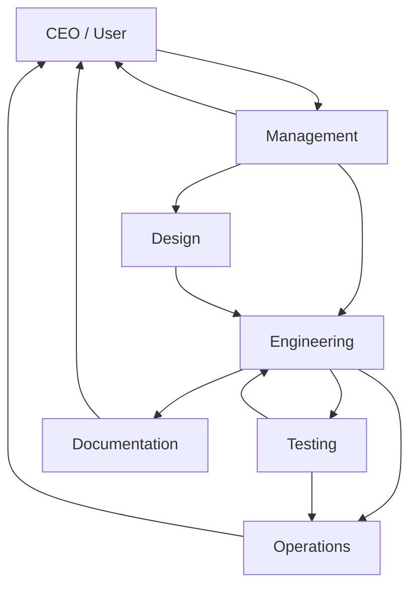

# Departments

## Purpose

This document defines the departments of the Hackathon Foundation company model. Each department groups related roles under a shared focus area, with clear boundaries and responsibilities.

## Department structure

```
CEO (User)
│
├── Engineering
│   ├── Software Architect
│   ├── Frontend Engineer
│   ├── Backend Engineer
│   ├── Database Engineer
│   ├── API Engineer
│   ├── Security Engineer
│   ├── DevOps Engineer
│   └── Performance Engineer
│
├── Design
│   ├── UI/UX Designer
│   └── Presentation Coach
│
├── Testing
│   └── QA Engineer
│
├── Documentation
│   └── Documentation Engineer
│
├── Operations
│   └── DevOps Engineer
│
├── Management
│   ├── Project Manager
│   └── Product Manager
│
└── Community
    └── (reserved for future phases)
```

## Engineering

**Motto:** Build it right.

The Engineering department is responsible for all technical construction — architecture, frontend, backend, database, APIs, security, and performance. This is the largest department and the primary producer of code.

### Roles

| Role | Primary responsibility |
|---|---|
| Software Architect | System design, technology decisions, technical roadmap |
| Frontend Engineer | User-facing components, pages, state management, styling |
| Backend Engineer | Server logic, business rules, data processing |
| Database Engineer | Schema design, migrations, query optimization |
| API Engineer | API design, endpoint implementation, integration contracts |
| Security Engineer | Threat modeling, vulnerability assessment, security review |
| DevOps Engineer | CI/CD, deployment, infrastructure, monitoring |
| Performance Engineer | Optimization, profiling, load testing |

### How Engineering works

1. The Software Architect defines the system design.
2. The Product Manager defines the feature requirements.
3. The Frontend Engineer, Backend Engineer, API Engineer, and Database Engineer build in parallel based on the architecture.
4. The Security Engineer reviews for vulnerabilities.
5. The DevOps Engineer prepares deployment.
6. The Performance Engineer optimizes bottlenecks.

See [RESPONSIBILITIES.md](./RESPONSIBILITIES.md) for detailed role definitions.

---

## Design

**Motto:** Make it usable.

The Design department is responsible for user experience, visual design, and presentation quality. Design happens before and during engineering, not after.

### Roles

| Role | Primary responsibility |
|---|---|
| UI/UX Designer | Wireframes, design specs, component design system, accessibility |
| Presentation Coach | Slide decks, demo scripts, talking points, live demo preparation |

### How Design works

1. The UI/UX Designer produces wireframes and design specs before the Frontend Engineer writes code.
2. The Frontend Engineer implements the design.
3. The Presentation Coach prepares the hackathon pitch, slides, and demo.

---

## Testing

**Motto:** Prove it works.

The Testing department is responsible for quality assurance. Testing is not a phase — it is integrated into every workflow.

### Roles

| Role | Primary responsibility |
|---|---|
| QA Engineer | Test plans, test cases, manual and automated testing, bug reporting |

### How Testing works

1. The QA Engineer reviews feature specifications from the Product Manager.
2. The QA Engineer creates test plans before implementation begins.
3. After implementation, the QA Engineer executes tests and reports bugs.
4. The developer fixes bugs, and the QA Engineer verifies the fixes.

---

## Documentation

**Motto:** Write it down.

The Documentation department ensures that knowledge is captured, organized, and accessible. Documentation is a deliverable, not an afterthought.

### Roles

| Role | Primary responsibility |
|---|---|
| Documentation Engineer | README files, API documentation, setup guides, user guides, architecture documentation |

### How Documentation works

1. The Documentation Engineer works alongside Engineering.
2. As components are built, documentation is written.
3. Documentation follows the templates in `.templates/`.
4. All documentation is reviewed for accuracy by the relevant engineer.

---

## Operations

**Motto:** Ship it.

The Operations department ensures that the project can be built, deployed, and run reliably. In a hackathon context, this means setting up environments, CI/CD, and deployment early.

### Roles

| Role | Primary responsibility |
|---|---|
| DevOps Engineer | CI/CD pipelines, deployment configuration, environment setup, monitoring |

### How Operations works

1. The DevOps Engineer sets up CI/CD at the start of the project.
2. As features are completed, they are deployed incrementally.
3. The DevOps Engineer monitors for issues and rolls back if needed.

---

## Management

**Motto:** Know what to build and why.

The Management department bridges the gap between vision and execution. Management defines what to build, in what order, and ensures the team stays aligned.

### Roles

| Role | Primary responsibility |
|---|---|
| Product Manager | Feature definition, user stories, priority decisions, stakeholder communication |
| Project Manager | Task tracking, timeline management, status reporting, blocker resolution |

### How Management works

1. The Product Manager defines the feature backlog based on the project vision.
2. The Project Manager breaks features into tasks, assigns them to engineers, and tracks progress.
3. Management communicates status to the CEO (user).

---

## Community

**Motto:** Grow together.

The Community department is reserved for future phases of the repository. It will manage contributions, issues, discussions, and external engagement.

### Future roles

| Role | Future responsibility |
|---|---|
| Community Manager | Issue triage, contribution review, community discussions |
| Contributor | External contributions to roles, skills, templates, and rules |

## Department interaction model



## Department boundaries

Each department has clear boundaries:

- **Engineering** does not define features (that is Management).
- **Design** does not write production code (that is Engineering).
- **Testing** does not fix bugs (that is Engineering).
- **Documentation** does not design architecture (that is Engineering).
- **Operations** does not write business logic (that is Engineering).
- **Management** does not write code (that is Engineering).

Cross-department communication flows through the CEO, not directly between departments. This ensures the CEO maintains visibility and control.

For the full company model that explains how departments fit into the organization, see [COMPANY_MODEL.md](./COMPANY_MODEL.md). For detailed role responsibilities, see [RESPONSIBILITIES.md](./RESPONSIBILITIES.md). For role-specific skills, deliverables, and examples, see [ENGINEERING_ROLES.md](./ENGINEERING_ROLES.md).
