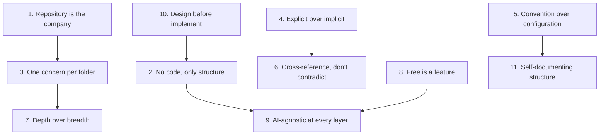

# Design Principles

## Purpose

This document defines the design principles that govern the structure, organization, and evolution of the Hackathon Foundation repository. Every file, folder, and naming decision should be consistent with these principles.

## The principles

### 1. The repository is the company

The user is the CEO. AI coding assistants are employees. The repository structure mirrors an engineering organization — roles, policies, capabilities, processes, and memory.

**Why:** This mental model makes abstract organizational concepts concrete. It answers "where do I put this?" by asking "where would a company put this?"

**Applies to:** `.agents/`, `.context/`, `.rules/`, `.skills/`, `.workflows/`, `.memory/`, `.playbooks/`

---

### 2. No code, only structure

The repository contains documentation, templates, and definitions — never executable code, never a library, never an application.

**Why:** The framework must be language-agnostic, stack-agnostic, and tool-agnostic. Code would tie it to a specific runtime or ecosystem. Structure is universal.

**Applies to:** Every folder.

---

### 3. One concern per folder

Each top-level folder owns exactly one responsibility. If a file could reasonably belong to two folders, the folder with the more specific purpose takes precedence, and a cross-reference is added.

**Why:** Clear boundaries prevent ambiguity. An AI agent should never wonder whether something belongs in rules or context. The answer is determined by a single principle.

**Applies to:** Top-level folder organization. See [REPOSITORY_STRUCTURE.md](./REPOSITORY_STRUCTURE.md).

---

### 4. Explicit over implicit

Every assumption is documented. Every convention is stated. Nothing is left to be inferred.

**Why:** AI coding assistants do not share human intuition. They perform best when rules, roles, and expectations are stated explicitly. An implicit convention is not a convention — it is a future inconsistency.

**Applies to:** `.rules/`, `.context/`, `.agents/`, `.templates/`

---

### 5. Convention over configuration

File placement follows predictable patterns. A user or AI can locate any file based on its purpose without consulting a configuration file.

**Why:** Configuration files are themselves structure that must be maintained. By using naming conventions and path conventions, the repository stays simple and self-documenting.

**Example:** A rule for React is at `.rules/react.md`. A skill for building APIs is at `.skills/build-api/README.md`. The path tells you everything.

**Applies to:** Every folder.

---

### 6. Cross-reference, duplicate, but never contradict

When information is relevant to multiple folders, cross-reference it. If a short summary is helpful context, duplicating a single line is acceptable. But no two files should contain conflicting information.

**Why:** Contradictions destroy trust. An AI that receives conflicting instructions will produce unpredictable output. Cross-references ensure that the canonical source is always identifiable.

**Applies to:** All documentation and definition files.

---

### 7. Depth over breadth

When the repository grows, it grows by adding depth — more files within existing folders — not by adding new top-level folders.

**Why:** The top-level structure is the user's mental map of the project. Changing it forces everyone to re-learn the map. Keeping it stable preserves the user's investment in understanding the system.

**Applies to:** Repository evolution and maintenance.

---

### 8. Free is a feature, not a limitation

Every design decision must work within the constraint that all AI models, tools, and APIs referenced are free. This constraint is non-negotiable.

**Why:** The Free Forever commitment (see [FREE_FOREVER.md](./FREE_FOREVER.md)) is the project's most important differentiator. It ensures accessibility and forces creative, resource-efficient solutions.

**Applies to:** `.context/` (tool recommendations), `.mcp/` (service configurations), every resource reference.

---

### 9. AI-agnostic at every layer

No file, folder, or convention should assume a specific AI model, tool, or platform. The repository must work equally well with OpenCode, Gemini CLI, Continue, Cline, Roo Code, VS Code Copilot, or any future AI coding assistant.

**Why:** Lock-in reduces the repository's value. Users should be able to adopt the framework without changing their preferred tools. The framework adapts to the tool; the tool does not adapt to the framework.

**Applies to:** Every file.

---

### 10. Design before implement

Every phase is designed completely before any content is written. The structure is decided before the files are created.

**Why:** Implementation without design produces inconsistent, hard-to-maintain results. Designing first ensures that every file has a deliberate place and purpose.

**Applies to:** Project development workflow. See [PHILOSOPHY.md](./PHILOSOPHY.md).

---

### 11. Self-documenting structure

Every folder has a README. Every file is understandable from its name and path. The repository should not require external documentation to navigate.

**Why:** External documentation becomes outdated. Self-documenting structure stays current because it is the structure itself.

**Applies to:** Every folder and file.

---

## Principle interactions

## How to apply these principles

When making any decision about the repository — adding a file, naming a folder, writing content — ask:

1. Does this violate "no code, only structure"? (P2)
2. Does this assume a specific AI tool or model? (P9)
3. Does this require a paid resource? (P8)
4. Does this belong in an existing folder, or does it require a new one? (P3, P7)
5. Is this convention documented somewhere? (P4, P5)
6. Is this decision consistent with the company mental model? (P1)

If the answer to 1, 2, or 3 is "yes," the decision must be reconsidered. If the answer to 4, 5, or 6 is "no," the missing documentation or structure must be added.

For the core concepts that underpin these principles, see [CORE_CONCEPTS.md](./CORE_CONCEPTS.md).
