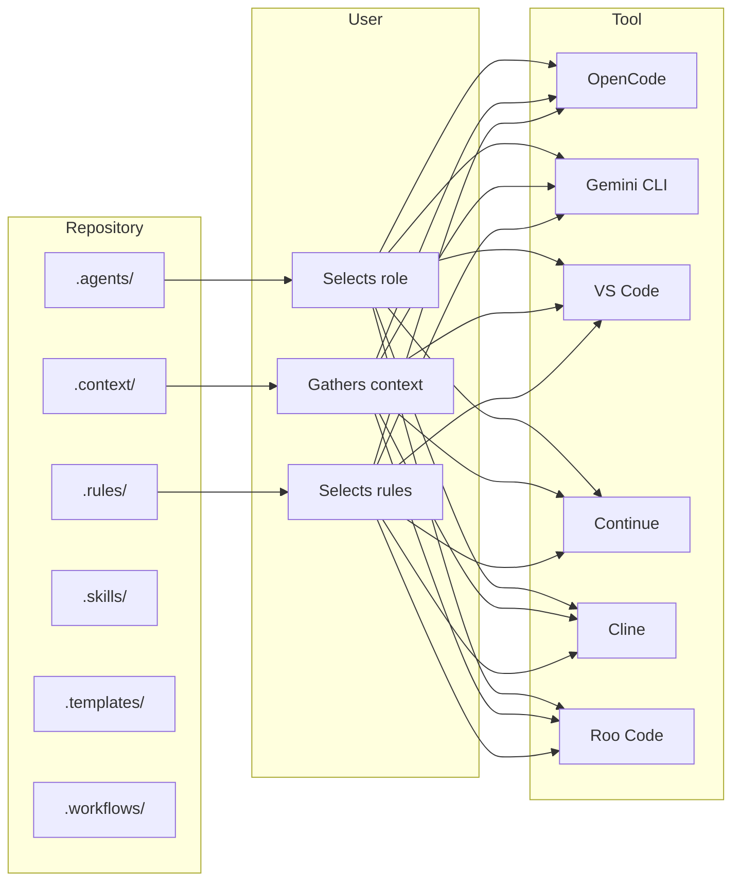

# Integrations

## Purpose

This document explains how Hackathon Foundation integrates with different AI coding assistants. It does not provide configuration files or setup scripts. It describes the *philosophy* of integration — how the repository's structure maps to each tool's interaction model.

For tool-specific integrations and configuration, see `.integrations/`.

## Integration philosophy

Hackathon Foundation is AI-agnostic. It is designed to work with any AI coding assistant, not tied to any specific one. The integration philosophy is:

> The repository provides the structure. The tool provides the interface. The user provides the orchestration.

Every AI coding assistant, regardless of its interface, accepts some form of input: system prompts, context, instructions. Hackathon Foundation organizes this input into a consistent structure — roles, context, rules, skills, templates, and workflows. The integration layer is the user, who selects the right content from the repository and feeds it into their chosen tool.



### Common integration pattern

Regardless of the tool, the integration follows the same pattern:

```
1. User opens the repository in their editor or terminal.
2. User determines the task.
3. User selects the role from .agents/<role>/.
4. User gathers relevant context from .context/.
5. User selects applicable rules from .rules/.
6. User opens the relevant skill from .skills/.
7. User provides these to the AI tool as context or instructions.
8. AI executes and produces output.
9. User reviews, saves output, and updates .memory/.
```

The differences between tools are in *how* the content is provided — as a system prompt, as files attached to a conversation, as rules in a configuration file, or as direct paste into a chat interface.

---

## OpenCode

**Type:** CLI-based AI coding assistant

**Interface:** Terminal, project-aware tool

### How it works

OpenCode operates as a CLI tool that reads files from the project directory and uses them as context. It has direct access to the file system and can read, write, and edit files within the project.

### Integration approach

OpenCode's project-aware nature makes it a natural fit for Hackathon Foundation. The repository structure is directly accessible to the tool.

**Role integration:** The user opens the relevant `.agents/<role>/` files and provides them as context to OpenCode. The role's system prompt, rules, and workflow become OpenCode's instructions for the session.

**Context integration:** OpenCode automatically reads project files. The `.context/` directory serves as a persistent knowledge base that OpenCode references across sessions.

**Rules integration:** Rules from `.rules/` are provided as constraints. OpenCode follows them as behavioral instructions.

**Skills integration:** Skills from `.skills/` are provided as step-by-step guides. OpenCode executes the task following the skill's steps.

**Workflow integration:** Workflows from `.workflows/` define the session structure. The user follows the workflow steps, providing the relevant files at each step.

### User workflow

```
1. Open terminal in Hackathon-foundation/
2. Open .agents/frontend-engineer/ to read the role definition
3. Open .context/tech-stack.md and .context/design-system.md
4. Open .rules/react.md, .rules/typescript.md, .rules/tailwind.md
5. Open .skills/build-component/ for steps
6. Begin OpenCode session with context from steps 2-5
7. AI executes, user reviews, output is saved
```

### Strength

Deep file system access means OpenCode can read the entire repository structure without manual copy-paste. The user can reference files by path, and OpenCode reads them directly.

---

## Gemini CLI

**Type:** Google's CLI-based AI coding assistant

**Interface:** Terminal, file-aware

### How it works

Gemini CLI runs in the terminal and accepts project files as context. It is designed for code generation, explanation, and editing tasks directly in the project directory.

### Integration approach

Gemini CLI's file-aware design maps cleanly to Hackathon Foundation's file-based structure.

**Role integration:** The role definition files in `.agents/<role>/` are provided as system instructions. The role's purpose, responsibilities, and rules shape Gemini CLI's behavior.

**Context integration:** Context files from `.context/` are provided as reference material. Gemini CLI reads them to understand the project's goals, standards, and constraints.

**Rules integration:** Rules from `.rules/` are included as behavioral constraints. Gemini CLI generates output consistent with the project's coding standards.

**Memory integration:** Memory files from `.memory/` provide session continuity. Before starting, Gemini CLI reads the current state, decisions, and todos from `.memory/`.

### User workflow

```
1. Open terminal in project root
2. Provide .agents/<role>/ as instruction context
3. Provide .context/ files as knowledge context
4. Provide .rules/ files as constraint context
5. Provide .skills/<skill>/ as step guide
6. Execute the task
7. Review output, save to project, update .memory/
```

### Strength

Gemini CLI works well with the repository's file-based structure because both are file-oriented. The user provides file paths, and Gemini CLI reads and writes them directly.

---

## Continue

**Type:** VS Code extension for AI pair programming

**Interface:** Editor sidebar, inline code suggestions

### How it works

Continue adds an AI chat panel to VS Code. It can reference open files, selected code, and project context. It supports custom system prompts and model selection.

### Integration approach

Continue's session-based interaction model maps to Hackathon Foundation's role-based approach.

**Role integration:** The role definition from `.agents/<role>/` is added as a custom system prompt in Continue. This gives the AI a consistent identity across all interactions in the session.

**Context integration:** Context files from `.context/` are opened as reference tabs or added to the conversation context. Continue can read them alongside the task.

**Rules integration:** Rules from `.rules/` are added as instructions at the start of the session. The user types or pastes the relevant rules into the chat.

**Template integration:** Templates from `.templates/` are used as output formats. The user requests output that follows a specific template.

### User workflow

```
1. Open project in VS Code
2. Open Continue panel
3. Paste .agents/<role>/README.md as system prompt
4. Open .context/ files as reference
5. Start chat with: "I am a <role>. Follow the rules in .rules/<file>."
6. Describe the task
7. Review AI output, accept or revise
8. Save output and update .memory/
```

### Strength

Continue's interface is well-suited for conversational refinement. The user can iterate with the AI, refine output, and then save it. This matches the CEO-review pattern well.

---

## Cline

**Type:** VS Code extension for autonomous AI coding

**Interface:** Editor sidebar, file system access, terminal access

### How it works

Cline has deeper file system and terminal access than most chat-based extensions. It can read, write, and edit files, run terminal commands, and execute tasks autonomously within defined boundaries.

### Integration approach

Cline's autonomous capabilities make it well-suited for executing workflows from `.workflows/` end to end.

**Role integration:** The role definition from `.agents/<role>/` is provided as Cline's system prompt. Cline operates as that role throughout the session.

**Workflow integration:** A workflow from `.workflows/` is provided as the task structure. Cline follows the workflow steps autonomously.

**Rule enforcement:** Rules from `.rules/` are provided as constraints. Cline checks its own output against the rules.

**Memory updates:** After completing a task, Cline updates `.memory/` and `.summaries/` as specified in the workflow.

### User workflow

```
1. Open project in VS Code
2. Open Cline
3. Provide .agents/<role>/ as system prompt
4. Provide .workflows/<workflow>/ as task structure
5. Provide relevant .context/ and .rules/ files
6. Start Cline task
7. Cline executes steps, writes files, updates memory
8. User reviews all changes
```

### Strength

Cline's autonomy means it can execute multi-step workflows without constant user interaction. The user provides the workflow, and Cline follows it, updating memory and summaries along the way.

---

## Roo Code

**Type:** AI coding assistant

**Interface:** Editor extension, file-aware

### How it works

Roo Code integrates with the editor to provide AI-assisted code generation and editing. It can read project files, suggest changes, and apply them.

### Integration approach

Roo Code's file-aware design works naturally with Hackathon Foundation's structured content.

**Role integration:** The role definition is provided as the session context. Roo Code adopts the role's identity and responsibilities.

**Context integration:** Context files are opened or referenced. Roo Code reads them to understand the project.

**Rules integration:** Rules are provided as session instructions. Roo Code generates code that complies with them.

**Skill integration:** Skills guide the execution approach. Roo Code follows the skill's steps.

### User workflow

```
1. Open project in editor
2. Open Roo Code
3. Provide .agents/<role>/ as context
4. Provide .context/ and .rules/ files
5. Describe task referencing .skills/<skill>/
6. Roo Code generates output
7. Review, accept, save
8. Update .memory/
```

### Strength

Roo Code's file context awareness means it can reference multiple project files simultaneously, making it suitable for tasks that require understanding the full codebase.

---

## VS Code (GitHub Copilot)

**Type:** Editor with built-in AI assistance

**Interface:** Inline completions, chat panel, agent mode

### How it works

VS Code includes GitHub Copilot for inline code completions and a chat panel for conversational AI interaction. Copilot has project-level context awareness.

### Integration approach

VS Code serves as the host environment for multiple AI integrations. It is also a standalone AI assistant through GitHub Copilot.

**Role integration:** Copilot's chat accepts system prompts. The role definition from `.agents/<role>/` is provided as a session instruction.

**Context integration:** Copilot reads the open project for context. The `.context/` directory serves as documentation that Copilot can reference.

**Rules integration:** Rules are enforced through Copilot's awareness of the project's patterns. Explicit rule files can be provided in chat instructions.

**Template integration:** Templates from `.templates/` are used as structures that Copilot fills in.

### User workflow

```
1. Open project in VS Code
2. Open Copilot chat
3. Provide role context: "Act as a <role> from .agents/<role>/"
4. Describe the task with context from .context/ and .rules/
5. Copilot generates code or suggestions
6. Accept inline completions or chat output
7. Save and update .memory/
```

### Strength

VS Code is the most widely used editor, and its multiple integration points (inline completions, chat, agent mode) mean that Hackathon Foundation content can be used at different levels of depth — from quick completions to full session-based role execution.

---

## Tool comparison

| Tool | Interface | Autonomy | Best for |
|---|---|---|---|
| OpenCode | CLI, file-aware | Medium | Project-aware sessions, file reading/writing |
| Gemini CLI | CLI, file-aware | Medium | File-based tasks, large context |
| Continue | Editor chat | Low | Conversational refinement, iteration |
| Cline | Editor, autonomous | High | Multi-step workflow execution |
| Roo Code | Editor, file-aware | Medium | Code generation with full context |
| VS Code Copilot | Editor inline + chat | Low to medium | Quick completions, chat-based tasks |

## Consistency across tools

Regardless of which tool is used, the integration principles remain the same:

1. **The repository is the source of truth.** All role definitions, context, rules, skills, and templates live in the repository, not in the tool's configuration.
2. **The user selects what to provide.** The tool does not automatically know the user's intent. The user chooses the role, context, rules, and skills for each session.
3. **Output is reviewed.** Every tool produces output that must be reviewed against the project's rules and templates before acceptance.
4. **Memory is updated after each session.** The `.memory/` directory is the persistent record, not the tool's conversation history.

## Adding new integrations

The integration philosophy extends to any AI coding assistant:

1. Understand what the tool accepts as input (system prompt, context files, instructions).
2. Map Hackathon Foundation's content types (role, context, rule, skill, workflow, template) to the tool's input mechanisms.
3. Document the mapping in `.integrations/<tool>/README.md`.
4. Follow the same interaction pattern: select, provide, execute, review, record.

For the repository structure that provides the content for these integrations, see [REPOSITORY_STRUCTURE.md](./REPOSITORY_STRUCTURE.md). For roles that define how AI should behave in these tools, see [ENGINEERING_ROLES.md](./ENGINEERING_ROLES.md).
