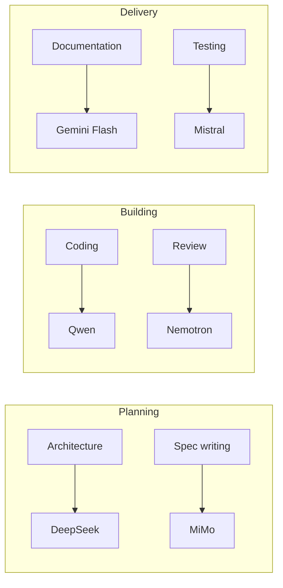

# Model Selection Guide

## Purpose

This document provides task-based recommendations for selecting the right free AI model for each engineering task. It maps common tasks to recommended models based on each model's strengths and weaknesses.

For the full model catalog, see [FREE_MODELS.md](./FREE_MODELS.md). For the directory overview and philosophy, see [AI_DIRECTORY.md](./AI_DIRECTORY.md).

## Selection principles

### Match the model to the task

Different tasks require different capabilities. A task that needs long-context processing should use a model with a large context window. A task that needs fast iteration should use a fast model. A task that processes sensitive data should use a local model.

### Consider the constraints

| Constraint | Preferred model characteristic |
|---|---|
| Sensitive data | Local model (Llama, Gemma, Granite) |
| No internet | Local model (Llama, Gemma) |
| Very large context | Large context model (Gemini Flash, Kimi, DeepSeek) |
| Fast iteration | Fast model (Gemini Flash, Nemotron, smaller models) |
| Multilingual | Multilingual model (Qwen, GLM, Mistral) |
| Code-heavy | Code-specialized model (DeepSeek, Qwen, Nemotron) |
| Documentation | Structured output model (MiMo, Gemini Flash) |

### Use multiple models

Do not use one model for everything. The best workflow often uses different models for different phases:



## Task-based recommendations

### Architecture and design

| Task | Recommended model | Why |
|---|---|---|
| System design | DeepSeek | Strong reasoning, considers trade-offs |
| Technology selection | DeepSeek | Evaluates options with clear rationale |
| Architecture review | DeepSeek, Nemotron | Structured analysis |
| API contract design | DeepSeek, Qwen | Precise, structured output |

### Frontend development

| Task | Recommended model | Why |
|---|---|---|
| Component implementation | DeepSeek, Qwen | Strong code generation |
| Component from design spec | Mistral, DeepSeek | Good instruction following |
| Styling and CSS | Gemini Flash | Fast iteration on visual output |
| State management | DeepSeek | Good at complex logic |
| Accessibility review | Nemotron | Structured checklist evaluation |

### Backend development

| Task | Recommended model | Why |
|---|---|---|
| API endpoint implementation | DeepSeek, Qwen | Strong code, good structure |
| Business logic | DeepSeek | Reasoning and algorithm design |
| Database queries | Qwen, DeepSeek | Strong SQL generation |
| Authentication | Mistral, DeepSeek | Security-conscious code |
| Server-side validation | Nemotron | Structured, thorough |

### Database

| Task | Recommended model | Why |
|---|---|---|
| Schema design | DeepSeek | Considers trade-offs, normalization |
| Query optimization | DeepSeek, Qwen | Strong at analytical thinking |
| Migration scripts | Granite, Mistral | Boilerplate generation |
| Data modeling | DeepSeek | Good at entity relationship design |

### API development

| Task | Recommended model | Why |
|---|---|---|
| API contract design | DeepSeek, Qwen | Precise, structured |
| Endpoint implementation | DeepSeek | Code generation |
| API documentation | MiMo, Gemini Flash | Clear, structured output |
| Integration tests | Nemotron | Thorough, structured |

### Testing

| Task | Recommended model | Why |
|---|---|---|
| Test plan creation | MiMo, Nemotron | Structured, comprehensive |
| Unit test generation | DeepSeek, Qwen | Code generation |
| Integration test generation | Nemotron | Thorough edge case coverage |
| Bug report writing | MiMo | Clear, structured communication |
| Test case design | Nemotron | Systematic, complete |

### Security

| Task | Recommended model | Why |
|---|---|---|
| Code security review | DeepSeek, Nemotron | Thorough analysis |
| Vulnerability assessment | DeepSeek | Good at identifying patterns |
| Threat modeling | DeepSeek | Structured reasoning |
| Secure code generation | Mistral, DeepSeek | Security-aware |

### DevOps

| Task | Recommended model | Why |
|---|---|---|
| CI/CD configuration | DeepSeek, Mistral | Configuration generation |
| Docker setup | Granite, Mistral | Boilerplate |
| Deployment scripts | DeepSeek | Scripting |
| Infrastructure docs | Gemini Flash, MiMo | Clear documentation |

### Documentation

| Task | Recommended model | Why |
|---|---|---|
| README writing | MiMo, Gemini Flash | Structured, clear |
| API documentation | MiMo | Organized, comprehensive |
| Setup guides | Gemini Flash | Step-by-step clarity |
| Architecture docs | DeepSeek | Technical accuracy |
| User guides | MiMo | Clear communication |

### Project management

| Task | Recommended model | Why |
|---|---|---|
| Feature specifications | MiMo | Structured, complete |
| Task breakdown | MiMo, DeepSeek | Analytical |
| Status reports | Gemini Flash | Fast, structured |
| Timeline creation | MiMo | Organized |

### Code review

| Task | Recommended model | Why |
|---|---|---|
| Pull request review | Nemotron | Structured, thorough |
| Code quality check | DeepSeek | Identifies issues |
| Security review | DeepSeek, Nemotron | Security-focused |
| Style compliance | Nemotron | Rule-based checking |

## Quick reference by role

| Role | Primary model | Secondary model | Use when |
|---|---|---|---|
| Software Architect | DeepSeek | Kimi | Architecture reasoning; long-context system understanding |
| Product Manager | MiMo | Gemini Flash | Feature specs; fast iteration |
| Project Manager | MiMo | Gemini Flash | Planning; status reporting |
| Frontend Engineer | DeepSeek | Mistral | Component code; design implementation |
| Backend Engineer | DeepSeek | Qwen | Server logic; multilingual |
| Full Stack Engineer | DeepSeek | Qwen | End-to-end features |
| Database Engineer | DeepSeek | Qwen | Schema; queries |
| API Engineer | DeepSeek | Qwen | Contracts; endpoints |
| QA Engineer | Nemotron | MiMo | Test plans; test cases |
| Security Engineer | DeepSeek | Nemotron | Vulnerability review |
| DevOps Engineer | Mistral | DeepSeek | Config; scripts |
| Documentation Engineer | MiMo | Gemini Flash | Docs; long-context processing |
| UI/UX Designer | Gemini Flash | MiMo | Specs; structured output |
| Presentation Coach | MiMo | Gemini Flash | Scripts; slides |

## Selection by constraint

When constraints are more important than the task type, use these guidelines:

### "I need privacy / no data sent to external APIs"

**Recommended:** Llama, Gemma, Granite (local execution)

These models run entirely on your hardware. No data leaves your machine. Suitable for sensitive codebases or when internet access is limited.

### "I need the longest possible context"

**Recommended:** Gemini Flash (1M+ tokens), Kimi (1M+ tokens), DeepSeek (1M tokens)

These models can process entire codebases in a single session. Use for codebase-wide analysis, large-document processing, or complex multi-file refactoring.

### "I need the fastest possible responses"

**Recommended:** Gemini Flash, Nemotron, smaller local models (Llama 8B, Gemma 9B)

These models respond quickly, enabling rapid iteration. Use for prototyping, simple tasks, or when working under tight time constraints.

### "I need multilingual support"

**Recommended:** Qwen, Mistral, GLM

These models perform well across multiple languages. Qwen and GLM are particularly strong in Chinese-English contexts. Mistral is strong in European languages.

### "I need the best possible code quality"

**Recommended:** DeepSeek, Qwen, Nemotron

These models are consistently ranked among the best for code generation and understanding. Use for complex implementation tasks where code quality is critical.

## Example: Multi-model workflow

A realistic hackathon workflow using multiple free models:

```
Phase 1: Planning
  Product Manager uses MiMo to write feature specs
  Software Architect uses DeepSeek to design architecture

Phase 2: Building
  Frontend Engineer uses DeepSeek to implement components
  Backend Engineer uses Qwen to implement API endpoints
  Database Engineer uses DeepSeek to design schema

Phase 3: Review
  Code Reviewer uses Nemotron to review all pull requests
  Security Engineer uses DeepSeek to review for vulnerabilities

Phase 4: Testing
  QA Engineer uses Nemotron to generate test plans
  QA Engineer uses Mistral to write test cases

Phase 5: Documentation
  Documentation Engineer uses MiMo to write user guides
  Documentation Engineer uses Gemini Flash to process large codebase

Phase 6: Presentation
  Presentation Coach uses MiMo to write pitch script
  Presentation Coach uses Gemini Flash to refine slides
```

## When to switch models

Switch models when:

1. **The current model is not producing quality results.** If the output has consistent errors or misses context, try a different model.
2. **The task changes.** A different phase of work may benefit from a different model.
3. **Context size exceeds the model's limit.** If the model cannot handle the required context, switch to a model with a larger context window.
4. **Speed becomes a priority.** For rapid prototyping, switch to a faster model.
5. **Privacy requirements emerge.** If sensitive data is involved, switch to a local model.

For the complete catalog of models, see [FREE_MODELS.md](./FREE_MODELS.md). For the directory philosophy, see [AI_DIRECTORY.md](./AI_DIRECTORY.md).
