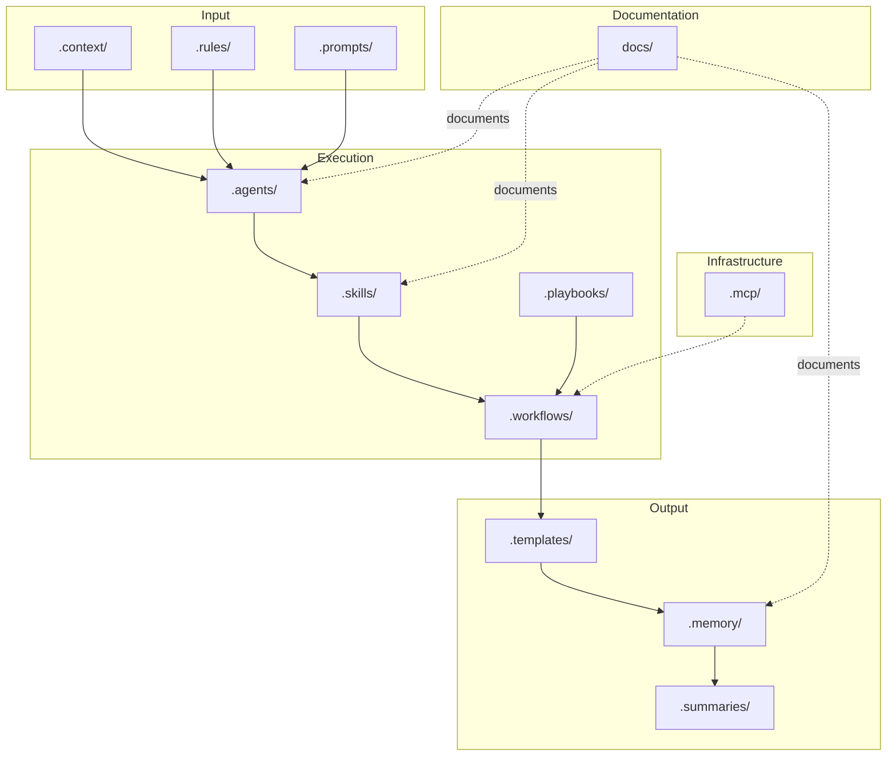

# Repository Structure

## Purpose

This document provides a detailed map of every top-level folder in the Hackathon Foundation repository. Each folder has a defined purpose, scope, and relationship to the other folders.

## Top-level structure

```
Hackathon-foundation/
│
├── .agents/           # Role definitions for AI coding assistants
├── .context/          # Shared project context and standards
├── .rules/            # Global rules and constraints
├── .skills/           # Reusable engineering capabilities
├── .memory/           # Long-term project memory
├── .summaries/        # Condensed project state summaries
├── .workflows/        # Step-by-step development processes
├── .playbooks/        # High-level hackathon strategies
├── .templates/        # Output blueprints and formats
├── .mcp/              # MCP server configurations
├── .prompts/          # Ready-to-use prompt templates
├── docs/              # Project documentation
│
├── README.md          # Project overview
├── LICENSE            # MIT License
└── .gitignore         # Git ignore rules
```

## Folder descriptions

### `.agents/`

**Purpose:** Defines the roles that AI coding assistants can assume. Each agent has a system prompt, rules, skills, workflow, examples, and expected outputs.

**Why it exists:** Without a defined role, AI produces generic output. A role gives the AI an identity, responsibilities, and constraints that shape every response. See [COMPANY_MODEL.md](./COMPANY_MODEL.md) for how roles fit into the company structure and [RESPONSIBILITIES.md](./RESPONSIBILITIES.md) for role-specific responsibilities.

**Relationship to other folders:** Agents reference `.context/` for shared knowledge, `.rules/` for constraints, `.skills/` for capabilities, `.workflows/` for processes, and `.templates/` for output formats.

**Structure:**
```
.agents/
├── README.md
├── software-architect/
├── frontend-engineer/
├── backend-engineer/
├── database-engineer/
├── api-engineer/
├── qa-engineer/
├── security-engineer/
├── devops-engineer/
├── documentation-engineer/
├── ui-designer/
├── presentation-coach/
├── research-engineer/
├── project-manager/
└── product-manager/
```

---

### `.context/`

**Purpose:** Stores the shared project knowledge that every AI should read before producing any output. This is the "company wiki."

**Why it exists:** AI coding assistants have no persistent memory. Every session starts fresh. Context files ensure that critical project knowledge — goals, standards, architecture — is available regardless of which AI tool or model is used.

**Relationship to other folders:** Context is consumed by `.agents/` (roles reference it in their system prompts), `.skills/` (skills assume context is known), and `.workflows/` (workflows reference context at specific steps).

**Structure:**
```
.context/
├── README.md
├── tech-stack.md
├── coding-style.md
├── project-goals.md
├── folder-structure.md
├── design-system.md
├── api-guidelines.md
├── security.md
└── performance.md
```

---

### `.rules/`

**Purpose:** Defines global constraints and policies that apply to all agents. Rules are non-negotiable.

**Why it exists:** Different AI models produce different code styles. Rules enforce consistency — in formatting, naming, architecture, and behavior — regardless of which AI is used.

**Relationship to other folders:** Rules apply to `.agents/` (each agent must follow them), `.skills/` (skills must produce output consistent with rules), and `.workflows/` (workflows check rules at review steps). For a detailed explanation of how rules work, see [RULES.md](../docs/RULES.md).

**Structure:**
```
.rules/
├── README.md
├── react.md
├── typescript.md
├── tailwind.md
├── git.md
├── documentation.md
├── testing.md
├── security.md
└── performance.md
```

---

### `.skills/`

**Purpose:** Documents reusable engineering capabilities that agents can execute. Each skill is a self-contained guide for performing a specific task.

**Why it exists:** Without skills, every agent reinvents how to perform common tasks. Skills encode best practices once and make them available to any role.

**Relationship to other folders:** Skills reference `.context/` for standards and `.rules/` for constraints. Agents select skills from this directory. Skills can be composed within `.workflows/`. For a detailed explanation of how skills work, see [SKILLS.md](../docs/SKILLS.md).

**Structure:**
```
.skills/
├── README.md
├── build-component/
├── build-api/
├── build-database/
├── debug/
├── review-code/
├── deploy/
├── optimize/
├── write-tests/
└── write-documentation/
```

---

### `.memory/`

**Purpose:** Tracks the project's long-term state — decisions, timeline, todos, bugs, and feature requests.

**Why it exists:** AI sessions are stateless. Memory provides the continuity that the AI lacks. Without it, every session starts from zero.

**Relationship to other folders:** Memory is updated after every `.workflows/` step. It is read by `.agents/` before they start work. It feeds into `.summaries/`.

**Structure:**
```
.memory/
├── README.md
├── project-state.md
├── decisions.md
├── timeline.md
├── todos.md
├── bugs.md
└── features.md
```

---

### `.summaries/`

**Purpose:** Stores condensed, AI-generated summaries of the project's current state. These are shorter and more actionable than the full memory.

**Why it exists:** Reading full memory files takes time and context window. Summaries give the CEO and new AI sessions a quick understanding of where things stand.

**Relationship to other folders:** Summaries are generated from `.memory/`. They are read by `.agents/` before starting work.

**Structure:**
```
.summaries/
├── README.md
├── current-state.md
├── recent-changes.md
└── next-steps.md
```

---

### `.workflows/`

**Purpose:** Defines step-by-step processes for common development scenarios.

**Why it exists:** Without a workflow, the AI and human work ad hoc. Workflows ensure that important steps — context reading, rule checking, testing, documentation — are not skipped.

**Relationship to other folders:** Workflows orchestrate `.agents/`, `.skills/`, `.rules/`, `.context/`, and `.templates/`. They are the "glue" that connects all other folders.

**Structure:**
```
.workflows/
├── README.md
├── new-project.md
├── new-feature.md
├── bug-fix.md
├── code-review.md
├── deployment.md
├── hackathon-sprint.md
└── submission.md
```

---

### `.playbooks/`

**Purpose:** High-level strategies for running hackathons — time management, idea validation, presentation preparation.

**Why it exists:** Hackathons are not just about code. Strategy, time management, and presentation quality often determine success. Playbooks capture this non-technical knowledge.

**Relationship to other folders:** Playbooks reference `.workflows/` for execution and `.agents/` for role assignments. They sit above workflows in the hierarchy of guidance.

**Structure:**
```
.playbooks/
├── README.md
├── 24-hour-hackathon.md
├── 48-hour-hackathon.md
├── weekend-hackathon.md
├── solo-hackathon.md
└── team-hackathon.md
```

---

### `.templates/`

**Purpose:** Provides blueprints for common deliverables — README files, architecture documents, API specifications, database schemas, components, services, and more.

**Why it exists:** Templates ensure consistency. They also save time — instead of deciding the structure of a file, the user and AI fill in a pre-approved format.

**Relationship to other folders:** Templates are consumed by `.agents/` (agents fill them in) and referenced by `.workflows/` (workflows specify which template to use at each step). For a detailed explanation of each template and when to use it, see [TEMPLATES.md](../docs/TEMPLATES.md).

**Structure:**
```
.templates/
├── README.md
├── architecture.md
├── api.md
├── database-schema.md
├── component.md
├── service.md
├── issue.md
├── pr.md
├── feature-request.md
└── bug-report.md
```

---

### `.mcp/`

**Purpose:** Configuration files for MCP (Model Context Protocol) servers — filesystem access, GitHub, git, browser tools, Playwright, Figma, Supabase, and Docker.

**Why it exists:** MCP gives AI coding assistants access to external tools and data. Configuration files make these integrations reproducible across projects.

**Relationship to other folders:** MCP configurations are tool-specific and orthogonal to the rest of the repository. They enable the AI to execute `.skills/` and `.workflows/` that require external tool access.

**Structure:**
```
.mcp/
├── README.md
├── filesystem.json
├── github.json
├── git.json
├── browser.json
├── playwright.json
├── figma.json
├── supabase.json
└── docker.json
```

---

### `.prompts/`

**Purpose:** A library of ready-to-use prompts for common tasks — kickstarting a project, reviewing code, generating documentation, debugging, and more.

**Why it exists:** Writing effective prompts is a skill. A prompt library ensures that the best prompts are captured and reusable, so every session does not require inventing a new prompt from scratch.

**Relationship to other folders:** Prompts reference `.context/`, `.rules/`, `.skills/`, and `.templates/`. They are the *input* that the user gives to the AI.

**Structure:**
```
.prompts/
├── README.md
├── kickstart-project.md
├── review-code.md
├── generate-docs.md
├── debug-issue.md
└── optimize-performance.md
```

---

### `docs/`

**Purpose:** Public-facing documentation for the project — vision, mission, architecture, setup guides, and references.

**Why it exists:** Documentation makes the project usable by others. It explains *why* the repository exists and *how* to use it.

**Relationship to other folders:** Docs describe the entire repository. They are the entry point for new users.

**Structure:**
```
docs/
└── (see docs/README.md for full index)
```

## Folder relationship diagram



## Why folders, not files

The repository uses folders instead of a flat file structure because:

1. **Discoverability.** A user browsing the repository can immediately see the major categories. Each folder acts as a visual index.
2. **Scalability.** A folder can contain many files without cluttering other categories. Adding a new role does not affect skills or templates.
3. **Modularity.** Folders can be copied, moved, or referenced independently.
4. **AI readability.** When an AI lists the top-level directory, it gets a clean overview of the entire system. This is far more useful than a flat list of 50+ files.

## Long-term maintenance

For the contribution workflow for adding new content to this structure, see [CONTRIBUTING.md](../docs/CONTRIBUTING.md).

The structure is designed to be maintained over years:

- **Additive growth.** New content goes inside existing folders. The top-level structure does not change.
- **No moving parts.** There is no build step, no configuration file, no schema to update. Adding a file is enough.
- **Convention over configuration.** The naming convention for folders and files is consistent. An AI can infer the purpose of any file from its path alone.

For the architectural model that explains how these folders relate, see [ARCHITECTURE.md](./ARCHITECTURE.md). For the design principles that guided this structure, see [DESIGN_PRINCIPLES.md](./DESIGN_PRINCIPLES.md). For the core concepts that underpin the framework, see [CORE_CONCEPTS.md](./CORE_CONCEPTS.md).
