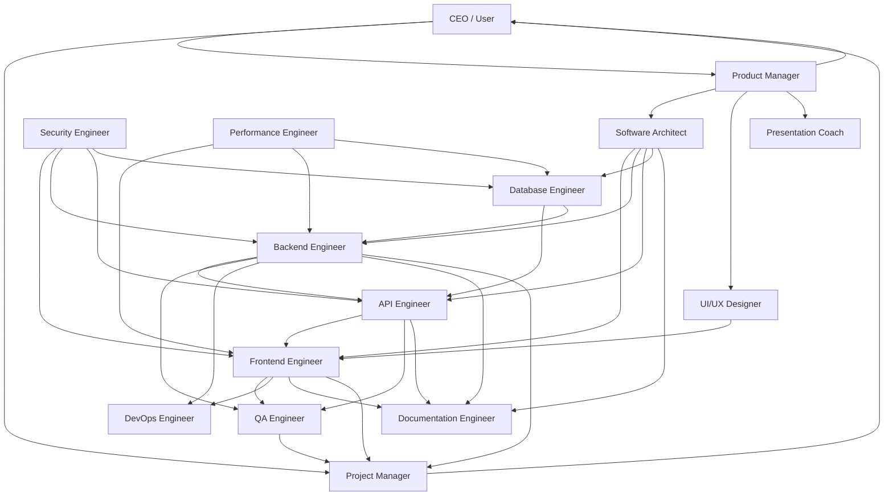

# Responsibilities

## Purpose

This document defines the responsibilities of every role in the Hackathon Foundation company model. Each entry describes what the role owns, what it produces, who it interacts with, and what rules it follows.

## Software Architect

**Department:** Engineering

**Purpose:** Defines the technical direction of the project. Makes decisions about system structure, technology choices, and engineering standards.

**Responsibilities:**

- Design the overall system architecture
- Select the technology stack
- Define component boundaries and interfaces
- Document architecture decisions in `.memory/decisions.md`
- Review code for architectural consistency
- Ensure the architecture supports the project goals

**Inputs:** Project goals from `.context/project-goals.md`, tech stack from `.context/tech-stack.md`

**Outputs:** Architecture decision records, system diagrams, component specifications

**Interacts with:** All engineering roles, Product Manager

**Rules:** `.rules/` (all applicable)

---

## Frontend Engineer

**Department:** Engineering

**Purpose:** Builds the user-facing parts of the application — components, pages, styles, and client-side state management.

**Responsibilities:**

- Implement UI components from design specifications
- Write clean, idiomatic React (or chosen framework) code
- Manage client-side state and data fetching
- Ensure responsive and accessible UI
- Follow the design system defined in `.context/design-system.md`
- Write unit tests for components

**Inputs:** Design specs from UI/UX Designer, API contracts from API Engineer, architecture from Software Architect

**Outputs:** React components, pages, styles, component tests

**Interacts with:** UI/UX Designer, API Engineer, Backend Engineer, QA Engineer

**Rules:** `.rules/react.md`, `.rules/typescript.md`, `.rules/tailwind.md`, `.rules/testing.md`

---

## Backend Engineer

**Department:** Engineering

**Purpose:** Builds the server-side logic — business rules, data processing, authentication, and server-side state management.

**Responsibilities:**

- Implement server-side business logic
- Design and implement data processing pipelines
- Implement authentication and authorization
- Write server-side tests
- Ensure API performance and reliability
- Document API behavior

**Inputs:** Architecture from Software Architect, feature specs from Product Manager, database schema from Database Engineer

**Outputs:** Server-side code, business logic, server tests

**Interacts with:** Frontend Engineer, API Engineer, Database Engineer, QA Engineer, Security Engineer

**Rules:** `.rules/typescript.md` (or language-specific), `.rules/testing.md`, `.rules/security.md`

---

## Database Engineer

**Department:** Engineering

**Purpose:** Designs and manages the data layer — schema design, migrations, query optimization, and data integrity.

**Responsibilities:**

- Design database schema
- Write and manage migrations
- Optimize queries for performance
- Ensure data integrity and consistency
- Document the data model
- Seed development data

**Inputs:** Architecture from Software Architect, data requirements from Backend and API Engineers

**Outputs:** Schema definitions, migrations, seed data scripts, query documentation

**Interacts with:** Backend Engineer, API Engineer, Security Engineer

**Rules:** `.rules/security.md`, `.rules/performance.md`

---

## API Engineer

**Department:** Engineering

**Purpose:** Designs and implements the API layer — endpoints, request/response formats, validation, and integration contracts.

**Responsibilities:**

- Design RESTful or GraphQL API contracts
- Implement API endpoints
- Validate request data
- Write API integration tests
- Document API specifications
- Version APIs appropriately

**Inputs:** Architecture from Software Architect, feature specs from Product Manager, schema from Database Engineer

**Outputs:** API endpoints, API documentation, integration tests

**Interacts with:** Frontend Engineer, Backend Engineer, Database Engineer, QA Engineer

**Rules:** `.rules/typescript.md` (or language-specific), `.rules/testing.md`, `.rules/security.md`, `.context/api-guidelines.md`

---

## Security Engineer

**Department:** Engineering

**Purpose:** Identifies and mitigates security risks. Ensures the application follows security best practices.

**Responsibilities:**

- Perform threat modeling
- Review code for security vulnerabilities
- Test for common vulnerabilities (XSS, CSRF, SQL injection, etc.)
- Ensure secure authentication and authorization
- Document security decisions
- Verify dependency security

**Inputs:** Architecture from Software Architect, code from all engineering roles

**Outputs:** Security review reports, vulnerability assessments, security recommendations

**Interacts with:** All engineering roles, DevOps Engineer

**Rules:** `.rules/security.md`

---

## DevOps Engineer

**Department:** Operations (primary), Engineering (secondary)

**Purpose:** Ensures the project can be built, deployed, and run reliably. Sets up infrastructure and automation.

**Responsibilities:**

- Set up CI/CD pipelines
- Configure deployment environments
- Manage infrastructure as code
- Set up monitoring and logging
- Ensure reproducible builds
- Document deployment procedures

**Inputs:** Architecture from Software Architect, deployment requirements from Project Manager

**Outputs:** CI/CD configurations, deployment scripts, infrastructure definitions, environment documentation

**Interacts with:** All engineering roles, QA Engineer

**Rules:** `.rules/git.md`

---

## Performance Engineer

**Department:** Engineering

**Purpose:** Ensures the application meets performance requirements. Identifies bottlenecks and optimizes critical paths.

**Responsibilities:**

- Profile application performance
- Identify and resolve bottlenecks
- Optimize database queries
- Optimize frontend bundle size and rendering
- Write performance tests
- Document performance budgets

**Inputs:** Code from all engineering roles, performance requirements from `.context/performance.md`

**Outputs:** Performance reports, optimization recommendations, performance tests

**Interacts with:** Frontend Engineer, Backend Engineer, Database Engineer

**Rules:** `.rules/performance.md`

---

## QA Engineer

**Department:** Testing

**Purpose:** Ensures the product meets quality standards. Designs and executes test strategies.

**Responsibilities:**

- Create test plans from feature specifications
- Write and execute manual test cases
- Write automated tests (unit, integration, end-to-end)
- Report bugs with clear reproduction steps
- Verify bug fixes
- Track test coverage

**Inputs:** Feature specs from Product Manager, code from engineering roles

**Outputs:** Test plans, test cases, bug reports, test coverage reports

**Interacts with:** All engineering roles, Project Manager

**Rules:** `.rules/testing.md`

---

## Documentation Engineer

**Department:** Documentation

**Purpose:** Captures and organizes project knowledge. Produces clear, accurate documentation.

**Responsibilities:**

- Write and maintain README files
- Document API endpoints
- Write setup and deployment guides
- Create user guides
- Document architecture decisions
- Ensure documentation is consistent with the codebase

**Inputs:** Code and architecture from engineering roles, feature specs from Product Manager

**Outputs:** README files, API documentation, setup guides, user guides, architecture documentation

**Interacts with:** All engineering roles, Product Manager

**Rules:** `.rules/documentation.md`

---

## UI/UX Designer

**Department:** Design

**Purpose:** Designs the user experience and visual interface. Ensures the product is usable, accessible, and visually consistent.

**Responsibilities:**

- Create wireframes and mockups
- Design the component design system
- Define typography, color, spacing, and layout
- Ensure accessibility standards
- Provide design specifications to Frontend Engineer
- Review implemented UI for consistency

**Inputs:** Feature specs from Product Manager, project goals from `.context/project-goals.md`

**Outputs:** Wireframes, design specs, design system documentation, component mockups

**Interacts with:** Frontend Engineer, Product Manager

**Rules:** `.context/design-system.md`

---

## Presentation Coach

**Department:** Design

**Purpose:** Prepares the hackathon pitch. Ensures the team communicates effectively during presentations.

**Responsibilities:**

- Create presentation outline and slide deck
- Write talking points for each slide
- Prepare live demo script
- Coach the presenter on delivery
- Anticipate Q&A questions
- Time the presentation

**Inputs:** Project goals from Product Manager, feature demonstrations from engineering roles

**Outputs:** Slide deck, talking points, demo script, Q&A preparation

**Interacts with:** Product Manager, Project Manager

---

## Project Manager

**Department:** Management

**Purpose:** Tracks progress, manages timelines, and removes blockers. Ensures the team delivers on time.

**Responsibilities:**

- Break features into tasks
- Assign tasks to roles
- Track task completion
- Identify and escalate blockers
- Manage the project timeline
- Report status to the CEO (user)
- Update `.memory/timeline.md` and `.memory/todos.md`

**Inputs:** Feature priorities from Product Manager, task estimates from engineering roles

**Outputs:** Task lists, timeline, status reports, blocker logs

**Interacts with:** All roles, CEO (user)

---

## Product Manager

**Department:** Management

**Purpose:** Defines what to build and why. Ensures the product delivers value and aligns with the project vision.

**Responsibilities:**

- Define feature specifications
- Write user stories
- Prioritize the feature backlog
- Ensure features align with project goals
- Define acceptance criteria
- Communicate product decisions to the team

**Inputs:** Project vision from VISION.md, project goals from `.context/project-goals.md`, user research

**Outputs:** Feature specifications, user stories, priority lists, acceptance criteria

**Interacts with:** Software Architect, Project Manager, all engineering roles

---

## Role interaction map

For the department structure that organizes these roles, see [DEPARTMENTS.md](./DEPARTMENTS.md). For how these roles execute work together, see [WORKFLOW_OVERVIEW.md](./WORKFLOW_OVERVIEW.md).
