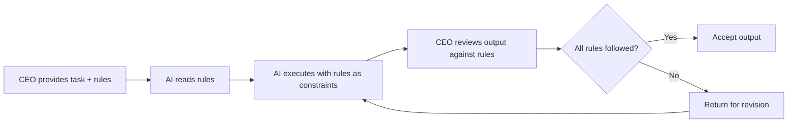
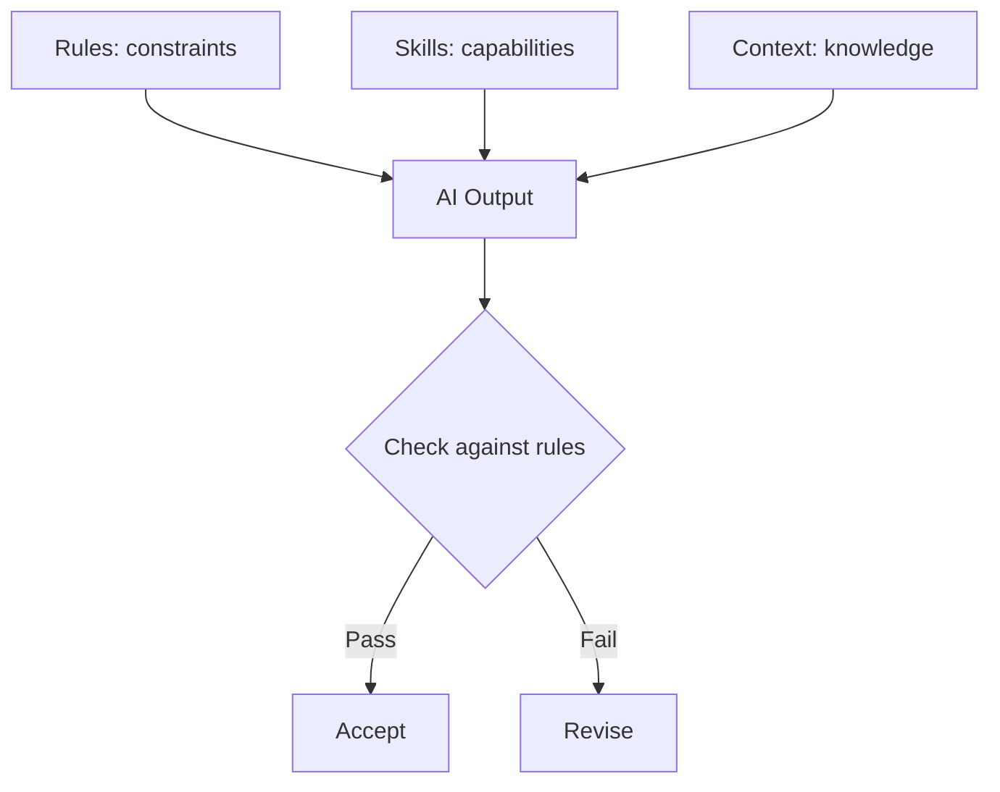

# Rules

## Purpose

This document explains the role of rules in the Hackathon Foundation framework — why they exist, how they work, how they differ from skills, and how AI should use them.

For the actual rule files, see `.rules/`.

## Why rules exist

Rules exist to solve a specific problem: **different AI models and different sessions produce different output.** Without rules, the same task given to the same AI on different days can generate code with different naming conventions, different file organization, and different quality levels.

Rules enforce consistency. They are the non-negotiable constraints that every AI coding assistant must follow, regardless of which role it is playing or which skill it is executing.

### What rules protect against

- Inconsistent code style across sessions
- Missing security practices
- Non-standard project structure
- Poor documentation quality
- Ignoring testing requirements
- Different AI models producing incompatible code

### The principle

> Rules are constraints. Constraints produce better output.

A Frontend Engineer without rules might use inline styles, class components, and any import style. A Frontend Engineer with rules uses Tailwind classes, functional components, and a consistent import order. The rules do not limit creativity — they channel it into a consistent direction.

## What rules are

Rules are statements of what **must** or **must not** happen. They are:

- **Non-negotiable.** Rules are not suggestions. If the AI violates a rule, the output should be rejected and revised.
- **Cross-role.** Rules apply to any role that produces output in their domain. React rules apply to anyone writing React code, not just the Frontend Engineer.
- **Checked at review.** Rules are checked when the CEO reviews output. Violations are caught before acceptance.
- **Stable.** Rules change infrequently. They represent the project's engineering standards.

### Rule structure

Each rule file in `.rules/` follows a consistent structure:

```
# Rule Name

## Purpose
Why this rule exists.

## Rules
List of specific rules, each with:
- Rule statement
- Why it matters
- Example of compliant code
- Example of non-compliant code

## Enforcement
How to check if rules are being followed.
```

## Rules by domain

| Rule file | Domain | Example rules |
|---|---|---|
| `.rules/react.md` | React components and patterns | Use functional components, not class components. Use hooks for state. |
| `.rules/typescript.md` | TypeScript usage | Prefer interfaces over types. Use strict mode. Avoid `any`. |
| `.rules/tailwind.md` | Tailwind CSS usage | Use utility classes, not custom CSS. Follow the design system spacing. |
| `.rules/git.md` | Git workflow | Write conventional commits. Keep commits atomic. |
| `.rules/documentation.md` | Documentation standards | Every public function has a doc comment. README is updated with each feature. |
| `.rules/testing.md` | Testing requirements | Every feature has unit tests. Critical paths have integration tests. |
| `.rules/security.md` | Security practices | Validate all user input. Use parameterized queries. Never hardcode secrets. |
| `.rules/performance.md` | Performance standards | Lazy load images. Avoid unnecessary re-renders. Optimize bundle size. |

## How AI should use rules

### Before execution

The AI reads the applicable rules before producing any output. The CEO provides the relevant rule files based on the task:

```
Task: Build a login form
Context: Project goals, design system
Rules to provide:
  - .rules/react.md (the component must follow React patterns)
  - .rules/typescript.md (the component uses TypeScript)
  - .rules/tailwind.md (the component uses Tailwind for styling)
  - .rules/testing.md (the component needs tests)
  - .rules/security.md (the form handles user input)
```

### During execution

The AI follows the rules as constraints:

- Uses functional components (React rule)
- Uses TypeScript interfaces for props (TypeScript rule)
- Uses Tailwind utility classes (Tailwind rule)
- Validates input and prevents XSS (Security rule)
- Writes tests alongside the component (Testing rule)

### During review

The CEO checks the output against the rules. If a rule is violated, the output is returned for revision.



## Difference between rules and skills

Rules and skills serve different purposes and are used differently:

| Dimension | Rules | Skills |
|---|---|---|
| Purpose | Enforce standards and constraints | Enable capabilities and tasks |
| Nature | Non-negotiable, cross-role | Reusable, any role can execute |
| Violation | Output is rejected | Skill is not executed correctly |
| Frequency | Stable, change infrequently | Updated as new techniques emerge |
| Scope | Apply to all output in a domain | Apply to specific tasks |
| Example | "Use functional components" | "How to build a React component" |

### When to use each

- **Use rules when** you need to ensure consistency across sessions and roles. Rules define the *boundaries* of acceptable output.
- **Use skills when** you need to teach the AI how to perform a specific task. Skills define the *steps* to produce correct output.

### How they work together

Rules and skills are complementary:



- **Context** tells the AI *what* to know.
- **Rules** tell the AI *how* to behave.
- **Skills** tell the AI *how* to do a specific task.

A Frontend Engineer building a component uses:
- Context to understand the project (tech stack, design system)
- Rules to write compliant code (React patterns, TypeScript, Tailwind, testing)
- Skills to execute the task (build-component skill with step-by-step instructions)

## Example: Rules in action

### Scenario

The CEO asks the Frontend Engineer to build a modal component.

### Rules provided

From `.rules/react.md`:
- Use functional components with TypeScript
- Use React portal for modals
- Manage visibility with boolean state, not CSS classes

From `.rules/typescript.md`:
- Define props interface
- Use strict typing, no `any`
- Use `React.FC` or explicit return type

From `.rules/tailwind.md`:
- Use Tailwind utility classes
- Use `z-50` for modals
- Use `fixed inset-0` for overlay
- Follow design system colors: `bg-white`, `text-gray-900`

From `.rules/security.md`:
- Prevent clickjacking with `pointer-events-none` on closed state
- Close modal on Escape key
- Trap focus within modal

### AI output

The AI produces a component that follows all rules:

- Functional component with TypeScript interface for props
- Uses `createPortal` for rendering at document root
- Uses Tailwind classes for all styling
- Handles Escape key, focus trapping, overlay click to close
- Includes unit tests

### Review

The CEO checks each rule:

| Rule | Status |
|---|---|
| Functional component | ✓ |
| TypeScript interface | ✓ |
| React portal | ✓ |
| Tailwind utilities | ✓ |
| Escape key handler | ✓ |
| Focus trap | ✓ |
| Tests included | ✓ |

The output is accepted.

## Long-term maintenance

Rules are maintained through:

- **Addition.** New rules are added when a new technology or pattern is adopted.
- **Refinement.** Existing rules are updated when better practices emerge.
- **Removal.** Rules are removed when a technology is deprecated.
- **Review.** Rules are reviewed periodically to ensure they remain relevant.

Rules should be changed infrequently and deliberately. Each change should be documented in `.memory/decisions.md`.

For the related concept of skills — which provide capabilities rather than constraints — see [SKILLS.md](./SKILLS.md). For context files that provide project knowledge alongside rules, see `.context/`. For definitions of the terms used in this document, see [GLOSSARY.md](./GLOSSARY.md).
