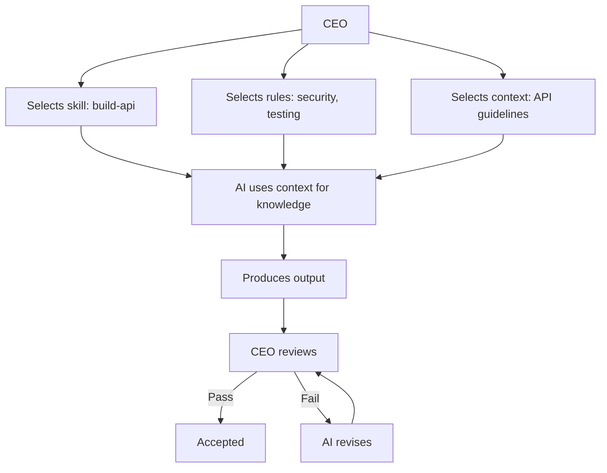
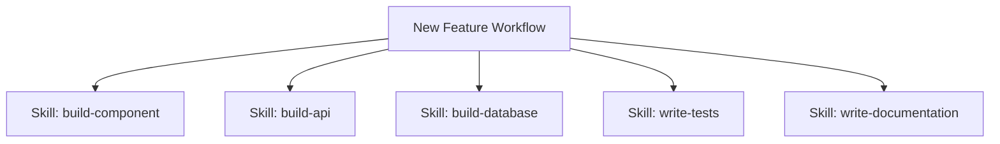

# Skills

## Purpose

This document explains the role of skills in the Hackathon Foundation framework — why they exist, how they work, how they differ from rules, and how AI should use them.

For the actual skill definitions, see `.skills/`.

## Why skills exist

Skills exist to solve a specific problem: **every AI session reinvents how to perform common tasks.** Building a component, creating an API, debugging an error, reviewing code — these are repeated across projects and sessions. Without skills, the AI starts from scratch each time, producing inconsistent quality and missing best practices.

Skills capture repeatable expertise. They are the documented best practices for performing specific engineering tasks.

### What skills prevent

- Reinventing the wheel for every task
- Inconsistent implementation patterns
- Missing steps in complex processes
- Knowledge loss between sessions
- Different AI models approaching tasks differently

### The principle

> Skills are reusable expertise. They encode what the best engineers know about a specific task.

A Backend Engineer who has never built a paginated API endpoint can execute the "build-api" skill and produce a correctly implemented, tested, and documented endpoint. The skill transfers expertise without requiring the AI to have prior experience.

## What skills are

Skills are step-by-step guides for performing a specific task. They are:

- **Self-contained.** Each skill includes everything needed to execute the task — prerequisites, steps, examples, and common pitfalls.
- **Role-independent.** Any role can execute any skill. The Frontend Engineer can use the testing skill. The Backend Engineer can use the documentation skill.
- **Composable.** Skills can be combined within workflows. A "new feature" workflow might compose the build-component, build-api, write-tests, and write-documentation skills.
- **Reusable across projects.** Skills are not project-specific. The same build-component skill works for any frontend project.

### Skill structure

Each skill in `.skills/` follows a consistent structure:

```
# Skill Name

## Purpose
What this skill accomplishes.

## Prerequisites
What the AI needs before starting.

## Steps
Numbered list of steps to execute.

## Examples
Concrete examples of the skill in action.

## Common pitfalls
Mistakes to avoid.

## Verification
How to confirm the skill was executed correctly.
```

## Skills by domain

| Skill | Purpose | Typical users |
|---|---|---|
| `build-component` | Create a UI component from a design spec | Frontend Engineer |
| `build-api` | Design and implement an API endpoint | API Engineer, Backend Engineer |
| `build-database` | Design schema and write migrations | Database Engineer |
| `debug` | Systematic approach to identifying and fixing bugs | Any engineering role |
| `review-code` | Structured code review process | Any engineering role |
| `deploy` | Deploy the application to a hosting platform | DevOps Engineer |
| `optimize` | Profile and optimize application performance | Performance Engineer |
| `write-tests` | Write comprehensive tests for a feature | QA Engineer, any engineering role |
| `write-documentation` | Write clear, structured documentation | Documentation Engineer, any engineering role |

## How AI should use skills

### Selection

The CEO selects the appropriate skill for the task:

```
Task: Implement a user registration endpoint
Context: Project goals, API guidelines, database schema
Rules: Typescript rules, security rules, testing rules
Skill: build-api
```

### Execution

The AI reads the skill, follows the steps, and produces output consistent with the skill's guidance:

1. Read the skill's prerequisites
2. Follow each numbered step
3. Check against the skill's verification criteria
4. Apply the applicable rules for constraints

### Combination with rules

Skills and rules work together:



- The skill tells the AI **what steps to follow**.
- The rules tell the AI **what constraints to respect**.
- The context tells the AI **what project knowledge to use**.

### Example flow

```
CEO: "I need a user profile page."

The CEO provides:
1. Context: project goals, design system, tech stack
2. Rules: React rules, TypeScript rules, Tailwind rules, testing rules
3. Skill: build-component

The AI:
1. Reads the build-component skill
2. Follows step 1: Understand the design spec
3. Follows step 2: Define the component interface (props type)
4. Follows step 3: Implement the component
5. Follows step 4: Add styles
6. Follows step 5: Handle states (loading, empty, error)
7. Follows step 6: Write tests
8. Checks all rules are satisfied
9. Produces the component
```

## Difference between skills and rules

| Dimension | Skills | Rules |
|---|---|---|
| Question answered | "How do I do this?" | "How must I behave?" |
| Nature | Procedural guidance | Declarative constraints |
| Flexibility | Steps can be adapted | Rules must be followed |
| Scope | One specific task | All output in a domain |
| Violation | Steps are not followed | Rule is broken |
| Update frequency | Updated as techniques improve | Changed infrequently |
| Audience | Any role executing the task | Any role producing output |

### Shared boundary

A rule might say: "All API endpoints must validate input."

A skill might say: "To build an API endpoint: 1) Define the route, 2) Define the request schema, 3) Implement validation, 4) Implement the handler, 5) Write tests."

The rule sets the **standard**. The skill provides the **method**.

## Skill composition

Skills can be composed into workflows. A single workflow might reference multiple skills:



Each skill is executed independently, but they are orchestrated by the workflow to produce a complete feature.

## Example: The build-api skill

### Purpose

Design and implement an API endpoint following the project's API guidelines.

### Prerequisites

- Database schema is defined
- API guidelines are read
- Feature specification is understood

### Steps

1. Define the endpoint route and HTTP method
2. Define the request schema (path params, query params, body)
3. Define the response schema
4. Implement input validation
5. Implement the endpoint handler
6. Add error handling
7. Write integration tests
8. Document the endpoint

### Usage

```
CEO: "Build a POST /api/bookmarks endpoint."
Skill invoked: build-api
Steps executed:
1. Route: POST /api/bookmarks
2. Body schema: { url: string, title: string, tags: string[] }
3. Response: { id: string, url: string, title: string, tags: string[], created_at: string }
4. Validation: URL is valid, title is 1-200 chars, tags max 10
5. Handler: Insert into bookmarks table, return created bookmark
6. Error handling: 400 for validation, 409 for duplicate, 500 for server error
7. Tests: valid request, missing fields, duplicate URL, invalid URL
8. Documentation: OpenAPI spec entry added
```

## Long-term maintenance

Skills are maintained through:

- **Creation.** New skills are created when repeatable tasks are identified.
- **Refinement.** Existing skills are updated when better approaches are discovered.
- **Composition.** Skills are composed into workflows for common scenarios.
- **Review.** Skills are reviewed for accuracy and completeness after each major project.

Skills live in `.skills/` and are organized by capability. Each skill is a subdirectory with a README and supporting files.

For the related concept of rules — which provide constraints rather than capabilities — see [RULES.md](./RULES.md). For context files that provide project knowledge, see `.context/`. For definitions of the terms used in this document, see [GLOSSARY.md](./GLOSSARY.md).
