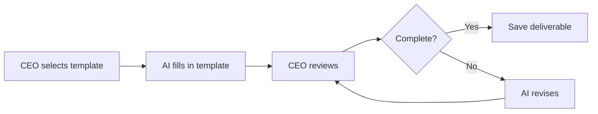
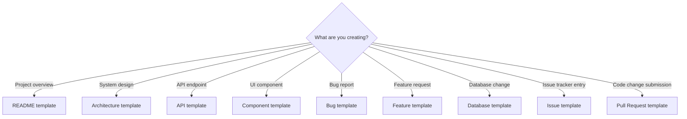

# Templates

## Purpose

This document describes every reusable template in the Hackathon Foundation framework — what each template is, when to use it, and why it exists.

For the actual template files, see `.templates/`.

## Why templates exist

Templates exist to solve a specific problem: **every deliverable needs a consistent structure, but inventing that structure each time wastes time and produces inconsistent results.** A README written without a template might miss setup instructions. An API specification written without a template might omit error responses. A bug report without a template might lack reproduction steps.

Templates provide a pre-approved structure for common deliverables. They guarantee minimum quality by ensuring nothing is forgotten.

### The principle

> Templates are starting points that guarantee completeness. The structure is fixed; the content is filled in.

## How templates work

1. The CEO selects the appropriate template for the deliverable.
2. The AI fills in the template, following its structure and prompts.
3. The CEO reviews the filled template against the project's rules and context.
4. The completed deliverable is saved to the appropriate location.

### When to use a template vs. when not to

| Use a template when | Do not use a template when |
|---|---|
| Creating a standard deliverable | Writing exploratory notes |
| The structure matters more than the content | Brainstorming or ideation |
| Multiple people will read the output | Personal notes |
| The output will be saved in the repository | Temporary communication |
| Quality must be consistent | Informal discussion |

## Templates

### README

**File:** `.templates/readme.md`

**Purpose:** A project README is the first thing users and contributors see. It must answer: what is this project, how do I set it up, how do I use it, and how do I contribute.

**When to use:** At the start of a new project. Updated with every major feature or change.

**Why it matters:** README quality is the single biggest factor in whether someone uses or contributes to a project. A good README reduces support questions and makes the project feel professional.

**Typical structure:**
- Project name and tagline
- Description (what and why)
- Features list
- Tech stack
- Setup instructions
- Usage guide
- Project structure overview
- Contributing guidelines
- License

**Used by:** Documentation Engineer, any role creating a new project.

---

### Architecture

**File:** `.templates/architecture.md`

**Purpose:** An architecture document describes how the system is structured — components, their relationships, data flow, and technology decisions. It serves as the authoritative reference for how the system works.

**When to use:** During the initial design phase. Updated when significant architectural changes are made.

**Why it matters:** Without an architecture document, each AI session (and each new team member) must rediscover the system's structure. The architecture document provides a shared mental model that everyone works from.

**Typical structure:**
- System overview and goals
- Architecture diagram (text or Mermaid)
- Component descriptions
- Data flow
- Technology stack and rationale
- Key design decisions
- Future considerations

**Used by:** Software Architect.

---

### API

**File:** `.templates/api.md`

**Purpose:** An API specification documents every endpoint — its purpose, request format, response format, and error codes. It serves as the contract between frontend and backend.

**When to use:** Before implementing any API endpoint. Updated when endpoints change.

**Why it matters:** API documentation prevents frontend-backend integration issues. When both sides agree on the contract before implementation, integration is smoother and bugs are fewer.

**Typical structure:**
- API overview and base URL
- Authentication
- Endpoint list
- Per endpoint: method, path, description, request body, response body, error codes
- Example requests and responses

**Used by:** API Engineer, Backend Engineer.

---

### Component

**File:** `.templates/component.md`

**Purpose:** A component specification defines a UI component — its props, states, behavior, and styling. It bridges the gap between design and implementation.

**When to use:** Before building a new UI component. Updated when component requirements change.

**Why it matters:** A component specification ensures the Frontend Engineer understands exactly what to build. It reduces back-and-forth between design and engineering and prevents rework.

**Typical structure:**
- Component name and purpose
- Props interface (TypeScript)
- Visual states (default, hover, active, disabled, loading, empty, error)
- Behavior description (clicks, keyboard, focus)
- Styling notes
- Accessibility requirements
- Usage examples

**Used by:** UI/UX Designer, Frontend Engineer.

---

### Issue

**File:** `.templates/issue.md`

**Purpose:** An issue template provides a consistent format for reporting problems, suggesting improvements, or proposing new features.

**When to use:** When creating any issue in the project's issue tracker.

**Why it matters:** A consistent issue format makes issues easier to triage, prioritize, and resolve. It ensures that every issue contains the information needed to act on it.

**Typical structure:**
- Issue type (bug, feature, improvement, question)
- Description
- Steps to reproduce (for bugs)
- Expected behavior
- Actual behavior
- Environment (browser, OS, version)
- Screenshots or logs
- Proposed solution (optional)

**Used by:** Any team member or contributor.

---

### Pull Request

**File:** `.templates/pull-request.md`

**Purpose:** A pull request template guides the contributor through describing their changes, explaining why they were made, and confirming that quality standards are met.

**When to use:** When opening a pull request.

**Why it matters:** A good PR description makes reviews faster and more thorough. It ensures the reviewer understands what changed, why, and what was verified.

**Typical structure:**
- Description of changes
- Related issue
- Type of change (bug fix, feature, refactor, docs)
- Checklist (tests passing, linted, documented, reviewed)
- Screenshots (for UI changes)
- Testing notes

**Used by:** Any team member opening a PR.

---

### Database

**File:** `.templates/database.md`

**Purpose:** A database schema document describes the data model — tables, columns, relationships, indexes, and constraints. It serves as the reference for how data is structured.

**When to use:** When designing a new database schema. Updated when schema changes are made.

**Why it matters:** A documented schema ensures that all engineers understand the data model. It prevents duplicate tables, inconsistent naming, and missing relationships.

**Typical structure:**
- Database overview and technology
- Entity list
- Per entity: table name, columns (name, type, constraints, default), relationships, indexes
- Entity-relationship diagram
- Migration notes
- Seed data plan

**Used by:** Database Engineer.

---

### Feature

**File:** `.templates/feature.md`

**Purpose:** A feature specification defines what a feature does, why it exists, and how it should work. It provides enough detail for engineering to implement and QA to test.

**When to use:** Before implementing a new feature. Updated when feature requirements change.

**Why it matters:** A feature specification prevents scope creep and miscommunication. It ensures that everyone agrees on what "done" means before work begins.

**Typical structure:**
- Feature name and description
- User story
- Acceptance criteria
- Technical notes
- Dependencies
- Estimated effort
- Priority

**Used by:** Product Manager.

---

### Bug

**File:** `.templates/bug.md`

**Purpose:** A bug report template captures everything needed to understand, reproduce, and fix a bug.

**When to use:** When a bug is discovered. The reporter fills in the template; the engineer uses it to debug and fix.

**Why it matters:** A complete bug report is the fastest path to a fix. Missing reproduction steps or environment details can add hours of back-and-forth.

**Typical structure:**
- Bug title and description
- Severity (critical, major, minor, cosmetic)
- Steps to reproduce
- Expected behavior
- Actual behavior
- Environment (browser, OS, device, app version)
- Screenshots or screen recording
- Console errors or logs
- Workaround (if any)

**Used by:** QA Engineer, any team member discovering a bug.

## Template selection guide

## Template usage by role

| Role | Most-used templates |
|---|---|
| Software Architect | Architecture |
| Frontend Engineer | Component |
| Backend Engineer | API, Database |
| API Engineer | API |
| Database Engineer | Database |
| QA Engineer | Bug, Issue |
| Product Manager | Feature, Issue |
| Documentation Engineer | README, Architecture, API |
| Any role | Issue, Pull Request |

## Lifecycle of a template

1. **Design.** The template structure is defined based on the type of deliverable.
2. **Populate.** The AI fills in the template fields using context, rules, and skills.
3. **Review.** The CEO checks that every section is complete and correct.
4. **Save.** The completed document is saved to the appropriate location.
5. **Archive.** The template remains available for reuse in its directory.

Templates do not change with each use. They change only when the team identifies a gap or improvement in the structure.

For the rules that govern how templates are filled in, see [RULES.md](./RULES.md). For the skills that guide template execution, see [SKILLS.md](./SKILLS.md). For the complete repository structure including the `.templates/` directory, see [REPOSITORY_STRUCTURE.md](./REPOSITORY_STRUCTURE.md).
