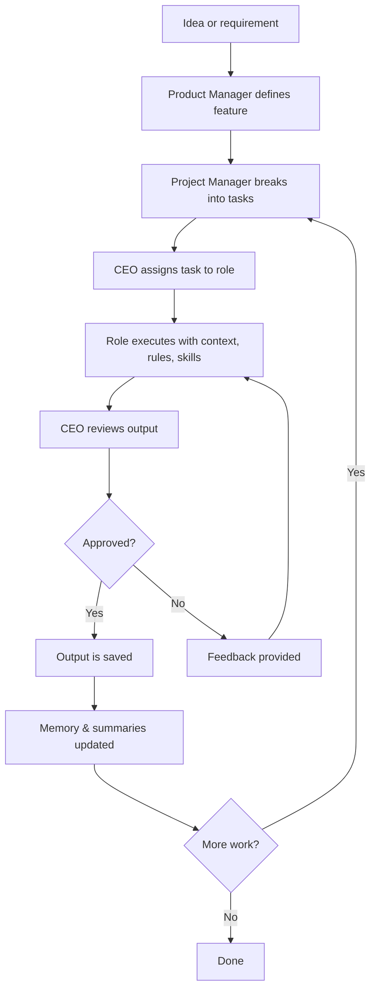
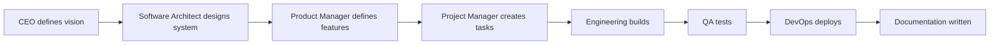
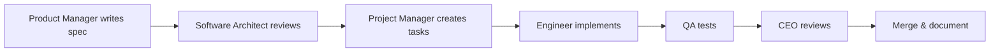
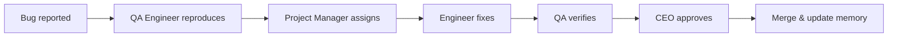

# Workflow Overview

## Purpose

This document describes how work flows through the Hackathon Foundation company model — from idea to deliverable. It explains the end-to-end process of task creation, delegation, execution, review, and recording.

## The task lifecycle

Every piece of work in the company follows a consistent lifecycle. Whether it is a new feature, a bug fix, or documentation, the same pattern applies.

## Phase 1: Definition

### 1.1 Idea

Every task starts as an idea. The idea may come from:

- The project vision (VISION.md)
- A feature request
- A bug report
- An architecture decision
- A user need identified by the Product Manager

The idea is recorded in `.memory/features.md` or `.memory/bugs.md`.

### 1.2 Feature specification

The Product Manager converts the idea into a feature specification:

- What the feature does
- Why it exists
- Acceptance criteria
- Dependencies
- Priority

### 1.3 Task breakdown

The Project Manager breaks the feature into individual tasks:

- Each task maps to one role
- Each task has a clear deliverable
- Each task has an estimated effort
- Tasks are ordered by dependency

## Phase 2: Delegation

### 2.1 CEO assigns

The CEO (user) selects a task and assigns it to the appropriate role:

1. Open the role definition in `.agents/<role>/`
2. Select the relevant context from `.context/`
3. Select the applicable rules from `.rules/`
4. Select the skill from `.skills/` if applicable
5. Select the template from `.templates/` if applicable
6. Write the prompt that includes all of the above
7. Send the prompt to the AI coding assistant

### 2.2 AI receives

The AI receives:

- **Who it is** (the role definition)
- **What it knows** (the context files)
- **How it behaves** (the rules)
- **What to do** (the task description)
- **What to produce** (the template)

## Phase 3: Execution

### 3.1 Context reading

The AI reads the shared context first:

- `.context/project-goals.md` — What are we building and why?
- `.context/tech-stack.md` — What technologies are we using?
- `.context/coding-style.md` — How should the code look?
- `.context/folder-structure.md` — Where do files go?
- Other context files as relevant

### 3.2 Role execution

The AI executes the task according to its role definition:

- Follows the role's rules
- Uses the role's skills
- Follows the role's workflow
- Produces output matching the template

### 3.3 Self-review

Before presenting output, the AI checks:

- Does the output follow all applicable rules?
- Does the output match the template?
- Is the output consistent with the context?
- Are there obvious errors or omissions?

## Phase 4: Review

### 4.1 CEO review

The CEO reviews the output against:

- The task description — does it do what was asked?
- The acceptance criteria — does it meet the definition of done?
- The rules — does it comply with project standards?
- The template — does it follow the expected format?
- Overall quality — is the output professional and correct?

### 4.2 Review outcomes

| Outcome | Action |
|---|---|
| Approved | Output is saved and memory is updated |
| Minor changes needed | CEO provides specific feedback, AI revises |
| Major rework needed | CEO provides detailed feedback, AI re-executes |
| Rejected | Task is reassessed, may be reassigned or descoped |

## Phase 5: Recording

### 5.1 Save output

The approved output is saved to the appropriate location:

- Code goes into the project's `src/` directory
- Documentation goes into `docs/`
- Architecture decisions go into `.memory/decisions.md`
- Templates and definitions go into the relevant `.agents/`, `.skills/`, etc.

### 5.2 Update memory

The CEO (or AI, if delegated) updates:

| File | What to update |
|---|---|
| `.memory/project-state.md` | Current status of the project |
| `.memory/decisions.md` | Any decisions made during the session |
| `.memory/timeline.md` | What was accomplished |
| `.memory/todos.md` | Completed tasks removed, new tasks added |
| `.memory/bugs.md` | New bugs found, fixed bugs closed |
| `.memory/features.md` | Completed features marked done |

### 5.3 Update summaries

Key changes are reflected in `.summaries/`:

- `.summaries/current-state.md` — What is the state of the project now?
- `.summaries/recent-changes.md` — What changed in this session?
- `.summaries/next-steps.md` — What should be done next?

## Workflow types

Different scenarios use different workflow patterns.

### New project workflow

### New feature workflow

### Bug fix workflow

## Communication during workflows

### Status updates

The Project Manager communicates status to the CEO:

- What was completed
- What is in progress
- What is blocked
- What is next

### Handoffs

When a task moves from one role to another, the CEO is the intermediary:

1. Engineer completes task
2. CEO reviews
3. CEO assigns next role
4. CEO provides context from previous step

This ensures the CEO remains informed at every stage.

## Scalability

For a small hackathon project, a single workflow may cover the entire project. For a larger project, multiple workflows run in parallel — one per feature or workstream.

The workflow structure does not change with project size. The same phases apply whether the task is building a button or designing the entire system.

For the company model that defines the roles executing these workflows, see [COMPANY_MODEL.md](./COMPANY_MODEL.md). For the detailed responsibilities of each role, see [RESPONSIBILITIES.md](./RESPONSIBILITIES.md). For role-specific skills, deliverables, and examples, see [ENGINEERING_ROLES.md](./ENGINEERING_ROLES.md). For reusable workflow definitions, see `.workflows/`.
